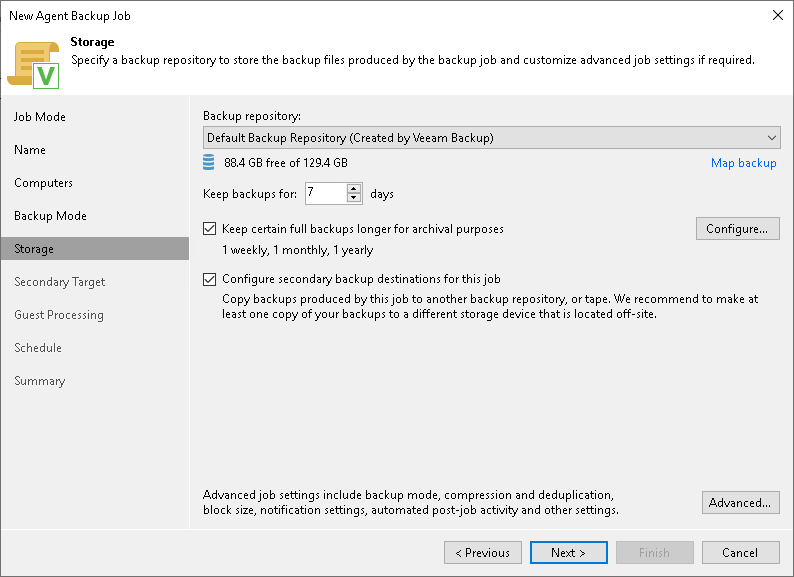

# Step 7. Specify Backup Storage Settings

Specify settings for the target backup repository:

1. In the Backup repository list, you can select from the following types of backup repositories:

* Veeam backup repository configured on the backup server that will manage the created backup job.
* Cloud repository allocated to your tenant account by a Veeam Cloud Connect service provider.

When you select a backup repository, Veeam Backup & Replication automatically checks how much free space is available on the backup repository.

|  |
| --- |
| NOTE |
| Keep in mind when you work with cloud machines, Veeam Backup & Replication displays only AWS or Azure object storage repositories depending on the type of cloud machine you selected to back up. |

1. You can map the job to a specific backup stored in the backup repository. Backup job mapping can be helpful if you have moved backup files to a new backup repository and want to point the job to existing backups in this new backup repository. You can also use backup job mapping if the configuration database got corrupted and you need to reconfigure backup jobs.

To map the job to a backup, click the Map backup link and select the backup in the backup repository. Backups can be easily identified by job names. To find the backup, you can also use the search field at the bottom of the window.

|  |
| --- |
| NOTE |
| Consider the following:   * You cannot map a Veeam Agent backup job configured in Veeam Backup & Replication to a backup chain that was created by Veeam Agent operating in the standalone mode. * If you map a backup chain with GFS full backups to a backup job that has GFS retention disabled, the mapped GFS full backups will be deleted when the retention policy runs. To retain GFS backups, enable the same GFS retention settings in the target job before mapping. |

1. In the Keep backups for field, specify the number of days for which you want to store backup files in the target location. After this period is over, Veeam Agent will remove from the backup chain any restore points that are older than the specified retention period. By default, Veeam Agent keeps backup files for 7 days. To learn more, see [Short-Term Retention](agents_retention.md).
2. To use the GFS (Grandfather-Father-Son) retention scheme, select the Keep certain full backups longer for archival purposes check box and click Configure. In the Configure GFS window, specify how weekly, monthly and yearly full backups must be retained. To learn more, see [Long-Term Retention Policy (GFS)](gfs_retention_policy.md).
3. If you want to archive backup files created with the backup job to a secondary destination (backup repository or tape), select the Configure secondary destinations for this job check box. With this option enabled, the New Agent Backup Job wizard will include an additional step — [Secondary Target](agent_job_secondary_target.md). At the Secondary Target step of the wizard, you can link the backup job to the backup copy job or backup to tape backup job.

You can enable this option only if a backup copy job or backup to tape job is already configured on the backup server.

1. Click Advanced to specify advanced settings for the backup job. To learn more, see [Specify Advanced Backup Settings](agent_job_advanced.md).

