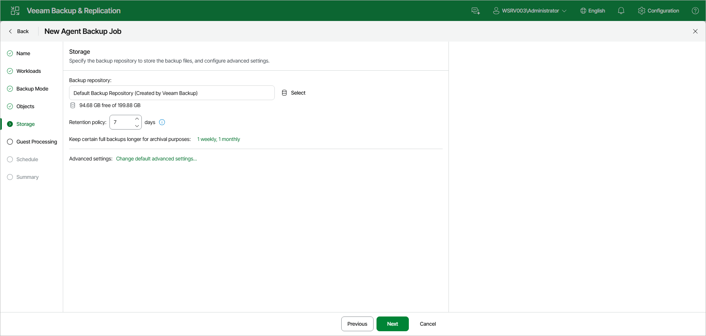

# Step 7. Specify Backup Storage Settings

At the Storage step of the wizard, specify the backup repository to store the backup files, and configure advanced settings.

|  |
| --- |
| NOTE |
| Secondary storage is not available in the Veeam Backup & Replication web UI. To archive backup files to a secondary destination, use the Veeam Backup & Replication console. To learn more, see [Specify Secondary Backup Target](agent_job_secondary_target.md). |

To specify backup storage settings:

1. In the Backup repository field, click Select and choose a Veeam backup repository configured on the backup server that will manage the backup job.

When you select a backup repository, Veeam Backup & Replication automatically checks how much free space is available on the backup repository.

1. In the Retention policy field, specify the number of days for which you want to store backup files in the target location. To learn more, see [Short-Term Retention](agents_retention.md).
2. To use the GFS retention scheme, next to Keep certain full backups longer for archival purposes, click the link and configure the GFS retention settings. To learn more, see [Long-Term Retention Policy (GFS)](gfs_retention_policy.md).

1. By default, the backup job uses pre-configured advanced settings, including a weekly synthetic full backup scheduled for Saturday. To review or update these settings, click Change default advanced settings. To learn more, see [Specify Advanced Backup Settings](agent_job_advanced_web.md).

Page updated 2026-07-15

