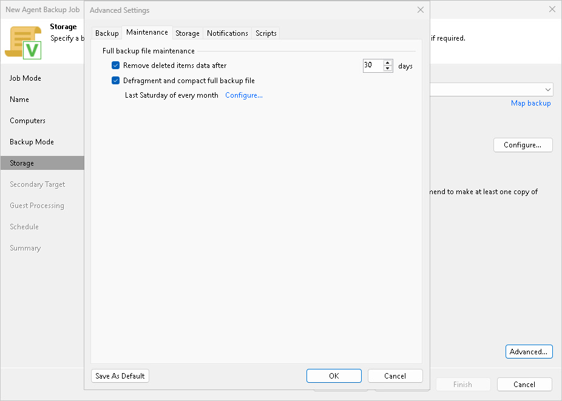

# Maintenance Settings

You can specify maintenance settings for a backup chain created with the Veeam Agent backup job managed by the backup server. Maintenance operations help make sure that the backup chain remains valid and consistent.

To specify maintenance settings for the backup job:

1. In the Advanced Settings window, select the Maintenance tab.
2. Select the Remove deleted items data after check box and specify the number of days for which you want to keep the backup created with the backup job in the target location.

For Veeam Agent backup jobs managed by the backup server, deleted items retention policy is similar to retention policy for deleted VMs. After you remove a protection group or individual computer from a Veeam Agent backup job, Veeam Backup & Replication will keep its data on the backup repository for the period that you have specified. When this period is over, backup data of this computer will be removed from the backup repository. For more information, see [Retention Policy for Deleted Items](retention_deleted_vms.md).

By default, the deleted items data retention period is 30 days. Do not set the deleted items retention period to 1 day or a similar short interval. In the opposite case, the backup job may work not as expected and remove data that you still require.

1. To periodically compact a full backup, select the Defragment and compact full backup file check box and click Configure to specify the schedule for the compact operation.

During the compact operation, Veeam Backup & Replication creates a new empty file and copies to it data blocks from the full backup file. As a result, the full backup file gets defragmented and the speed of reading and writing from/to the backup file increases.

If the full backup file contains data blocks for deleted items (protection groups or individual computers), Veeam Backup & Replication removes these data blocks. For more information, see [Compact of Full Backup File](backup_compact_file.md).

|  |
| --- |
| NOTE |
| Consider the following:   * If you want to periodically compact a full backup, you must make sure that you have enough free space in the target location. For the compact operation, the amount of free space must be equal to or more than the size of the full backup file. * In contrast to the compact operation for a VM backup, during compact of a full Veeam Agent backup file, Veeam Backup & Replication does not perform the data take out operation. If the full backup file contains data for a machine that has only one restore point and this restore point is older than 7 days, Veeam Backup & Replication will not extract data for this machine to a separate full backup file. |

Page updated 2026-06-19

