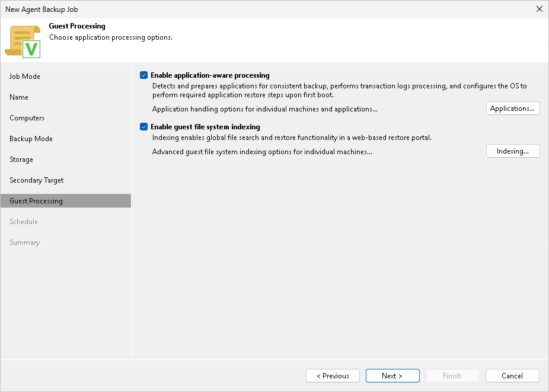

# Step 10. Specify Guest Processing Settings

At the Guest Processing step of the wizard, you can enable the following guest OS processing settings for a Veeam Agent backup job that includes Unix-based computers:

* [Use of backup job scripts](agent_job_unix_guest_scripts.md)
* [File indexing](agent_job_unix_guest_indexing.md)

Page updated 2026-06-19

