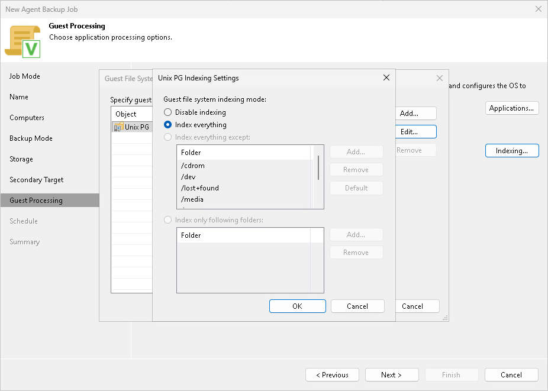

# File Indexing

To specify file indexing options:

1. At the Guest Processing step of the wizard, select the Enable guest file system indexing check box.
2. Click Indexing.
3. In the displayed list, select the protection group or individual computer and click Edit.

To define custom settings for a computer added as a part of a protection group, you must include the computer to the list as a standalone object. To do this, click Add and choose the computer whose settings you want to customize. Then select the computer in the list and define the necessary settings.

1. In the Indexing Settings window, select Index everything if you want to index all files within the backup scope that you have specified at the [Select Backup Mode](agent_job_unix_mode.md) step of the wizard.

|  |
| --- |
| NOTE |
| You cannot specify a custom indexing scope for Unix computers. For a file-level backup job that processes Unix computers, only the Index everything option is available. |

Page updated 2026-06-19

