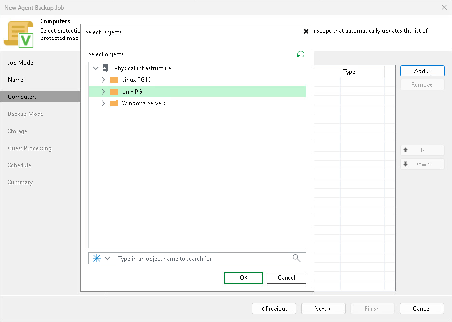
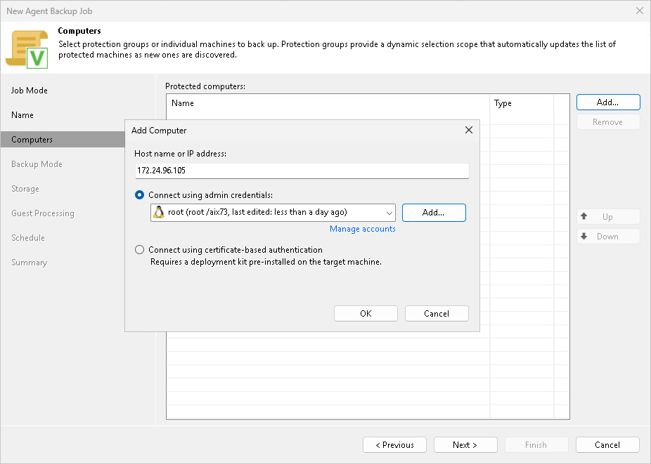

# Step 4. Select Computers to Back Up

At the Computers step of the wizard, select the protection groups and individual computers that you want to back up with the Veeam Agent backup job managed by the backup server.

You can add one or more protection groups and individual computers from the Veeam Backup & Replication inventory to the backup job. You can also add computers that are not added to inventory yet. In this case, Veeam Backup & Replication adds the computers to the job and to the Manually Added protection group.

If Veeam Backup & Replication discovers a new computer in a protection group after the Veeam Agent backup job is created, Veeam Backup & Replication automatically updates the job settings to include that computer.

|  |
| --- |
| NOTE |
| If you launched the New Agent Backup Job wizard by selecting Add to backup job > Unix > New job, the Protected computers list already contains the computers that you selected to add to the job. If necessary, you can remove computers from the job or add more computers. |

Adding Protection Groups and Computers from Inventory

To add protection groups and individual computers to the Veeam Agent backup job, do the following:

1. Click Add > Protection group.
2. In the Select Objects window, select one or more protection groups and computers, and click OK. To select multiple objects at once, press and hold [Ctrl] or [Shift].

To quickly find an object, use the search field at the bottom of the Select Objects window.

1. Enter the object name or part of it in the search field.
2. Click the Start search icon on the right, or press [Enter].

Adding New Computers

To add to the Veeam Agent backup job managed by the backup server new computers that do not exist in the inventory, do the following:

1. Click Add > Individual computer.
2. In the Add Computer window, in the Host name or IP address field, enter a full DNS name or hostname of the computer that you want to add to the job.
3. Select how Veeam Backup & Replication connects to the computer:

* Connect using admin credentials. In this case, from the Credentials list, select a user account that has administrative permissions on the computer that you want to add to the protection group. Veeam Backup & Replication will use this account to connect to the protected computer and perform the necessary operations on the computer: upload and install Veeam Agent, and so on.

If you have not set up credentials beforehand, click the Manage accounts link or click Add on the right to add credentials.

Veeam Backup & Replication allows to add the following types of credentials:

* Stored credentials. Select stored credentials if you want Veeam Backup & Replication to use the specified user name and password for each connection to Veeam Agent.
* Single-use credentials. Select single-use credentials if you do not want Veeam Backup & Replication to store credentials in the configuration database. With this option selected, Veeam Backup & Replication will use the specified user name and password only for the first connection to Veeam Agent. After that, Veeam Backup & Replication will use Veeam Transport Service to communicate with the Veeam Agent computer.

* Connect using certificate-based authentication. [For IBM-AIX machines only] Select this option, if you chose to pre-install Veeam Deployer Service on the computer that you want to add to the backup job. In this case, Veeam Backup & Replication will make the first communication with the computer using a temporary certificate. To learn more, see [Deploying Veeam Agent Using Veeam Deployment Kit](agents_deploy_deployer.md).

Page updated 2026-07-22

