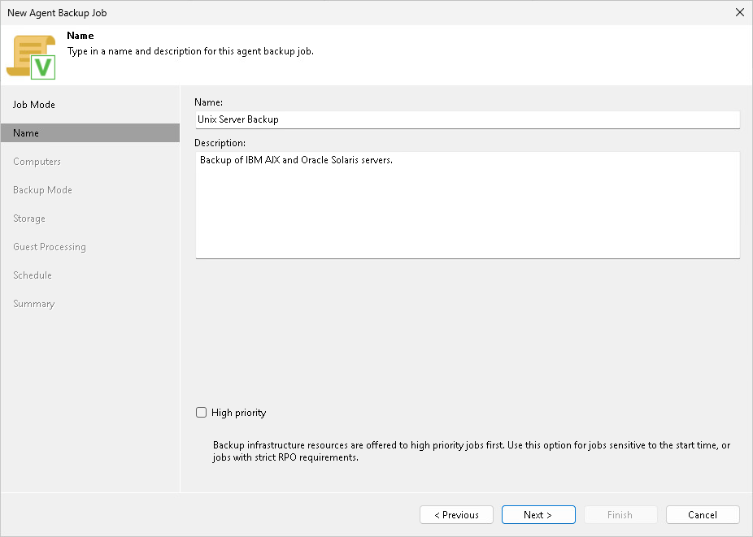

# Step 3. Specify Job Name and Description

At the Name step of the wizard, specify a name and description for the Veeam Agent backup job managed by the backup server.

1. In the Name field, enter a name for the backup job.
2. In the Description field, provide a description for future reference. By default, the description contains information about the user who created the job and the date and time when the job was created.
3. Select the High priority check box if you want the Veeam Backup & Replication resource scheduler to to give this job higher priority than similar jobs and allocate resources to it first. To learn more, see [Job Priorities](job_priorities.md).

Page updated 2026-06-19

