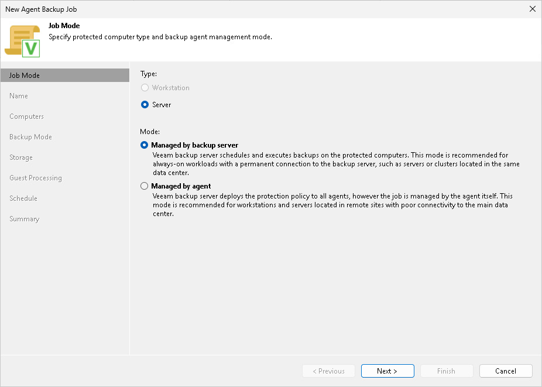

# Step 2. Select Job Mode

At the Job Mode step of the wizard, specify protection settings for the Veeam Agent backup job managed by the backup server.

Veeam Agent for Unix computers can be added to backup jobs as servers only. The Type field is set to Server automatically.

Selecting Job Mode

In the Mode section, select Managed by backup server to create a Veeam Agent backup job managed by the backup server.

If you select Managed by agent, you create a [Veeam Agent backup policy](agent_policy_create_unix.md).

Page updated 2026-06-19

