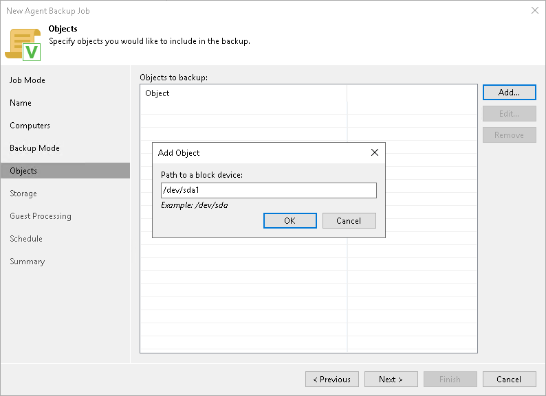

# Specifying Volumes to Back Up

The Objects step of the wizard is available if you have chosen to create volume-level backup.

At this step of the wizard, you must specify the backup scope — define what volumes you want to include in the backup. The specified backup scope settings will apply to all computers that are added to the backup job. If a specified volume does not exist on one or more computers in the job, the job will skip such volumes on those computers and back up only existing ones.

To specify the backup scope:

1. In the Objects to backup field, click Add and select the type of object that you want to include in the backup: Device, Mount point, LVM or BTRFS.
2. In the Add Object window, specify the object that you want to back up and click OK.

You can specify the following objects to back up:

* Block devices. You can include in the backup scope all volumes on a computer disk or individual volumes of a protected computer:

* To include all volumes on a computer disk in the backup, type the path to a block device that represents the disk whose volumes you want to back up. For example: /dev/sda.
* To include a specific volume of a protected computer in the backup, type the path to a block device that represents the volume that you want to back up. For example: /dev/sda1.

|  |
| --- |
| NOTE |
| If you include a block device in the backup, and this block device is a physical volume assigned to an LVM volume group, Veeam Agent will include the whole LVM volume group in the backup. |

* Mount points. You can include in the backup scope individual volumes of a protected computer. Type the path to a mount point of the volume that you want to back up. For example: / or /home.

|  |
| --- |
| IMPORTANT |
| Veeam Agent does not support backup of bind mount points. You must specify the path to the original mount point instead. |

* LVM volumes. You can include in the backup scope entire LVM volume groups or individual LVM logical volumes of a protected computer. Type the path to a mount point or a block device that represents the volume group or logical volume that you want to back up. For example: /dev/vg or /dev/vg/lv1.
* Btrfs subvolumes. You can include in the backup scope all Btrfs subvolumes of a Btrfs storage pool or specific Btrfs subvolumes.

* To include all subvolumes of a Btrfs pool in the backup, type the path to a block device that represents the Btrfs pool. For example: /dev/sda1.
* To include a specific Btrfs subvolume in the backup, type the path to a mount point of this subvolume. For example: /sub1.

1. Repeat steps 1–2 for all objects that you want to back up.

If you have created several system partitions, for example, a separate partition for the /boot directory, make sure that you include all of these partitions in the backup. Otherwise, Veeam Agent for Linux does not guarantee that the OS will boot properly when you attempt to recover from such backup.

