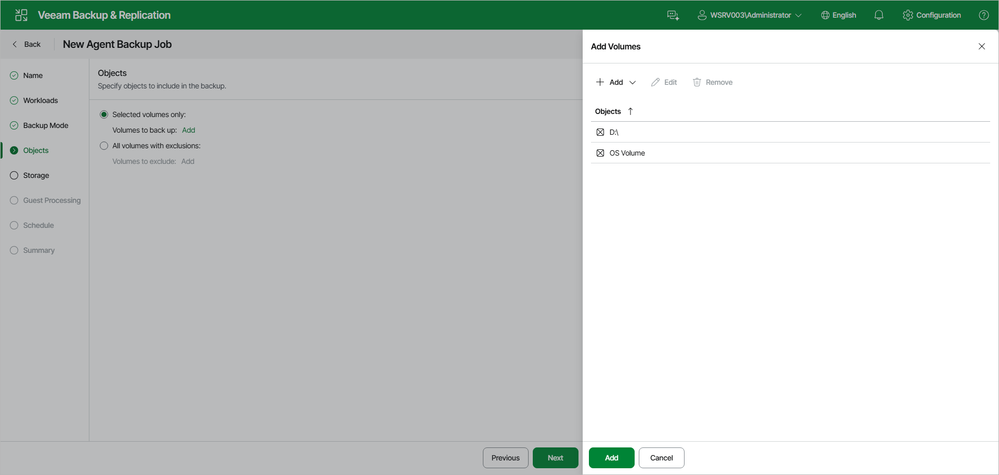

# Specifying Volumes to Back Up

The Objects step of the wizard is available if you have selected the Volume-level backup option at the [Backup Mode](agent_job_mode_web.md) step of the wizard.

At this step of the wizard, specify volumes to include in or exclude from the backup. The specified settings will apply to all computers that are added to the backup job. If a specified volume does not exist on one or more computers in the job, the job will skip such volume on those computers and back up only existing ones.

You can select one of the following options:

* Selected volumes only — select this option to back up only the volumes that you specify. Click Add and add the necessary objects in the Add Volumes window.
* All volumes with exclusions — select this option to back up the whole Veeam Agent computer and exclude specific volumes from the backup. Click Add and specify the volumes to exclude in the Add Volumes window.

In the Add Volumes window, you can add the following objects:

* OS volume — data on the OS installed on a protected computer. This object includes the Microsoft Windows system partition and boot partition of your computer. For GPT disks on Microsoft Windows 10, Windows 11, Windows Server 2012 R2, 2016, 2019, 2022 and 2025, the object additionally includes the recovery partition. To learn more, see the [System State Data Backup](https://helpcenter.veeam.com/docs/agentforwindows/userguide/system_state_backup.html?ver=13) section in the Veeam Agent for Microsoft Windows User Guide.

To add the OS volume, in the Add Volumes window, click Add and select the OS Volume option.

* Individual volumes.

To add individual volumes:

1. In the Add Volumes window, click Add and select the Volume option.
2. In the window that opens, type the drive letter of a volume, for example, C:\, and click OK.
3. Repeat steps a–b for each volume you want to add.

* Individual mount points.

To add individual mount points:

1. In the Add Volumes window, click Add and select the Volume option.
2. In the window that opens, type the path to a folder that is an entry point to the mounted volume, for example, C:\Data, and click OK.
3. Repeat steps a–b for each mount point you want to add.

You can also modify the list of objects in the Add Volumes window in the following ways:

* To edit an object, select it and click Edit on the toolbar.
* To remove an object from the list, select it and click Remove on the toolbar.

When you finish adding objects, click Add at the bottom of the Add Volumes window to save the list.

|  |
| --- |
| NOTE |
| Consider the following:   * If you include a system volume in the volume-level backup, Veeam Agent for Microsoft Windows automatically includes the System Reserved/UEFI or other system partitions in the backup too. * You cannot include volumes located on virtual hard disks (VHD or VHDX) in the volume-level backup. * Veeam Agent for Microsoft Windows cannot back up hidden non-system volumes. * Veeam Agent for Microsoft Windows automatically adds to the list of exclusions the following Microsoft Windows objects for all computer users: temporary files folder, Recycle Bin, Microsoft Windows pagefile, hibernate file and VSS snapshot files from the System Volume Information folder. |

Page updated 2026-07-15

