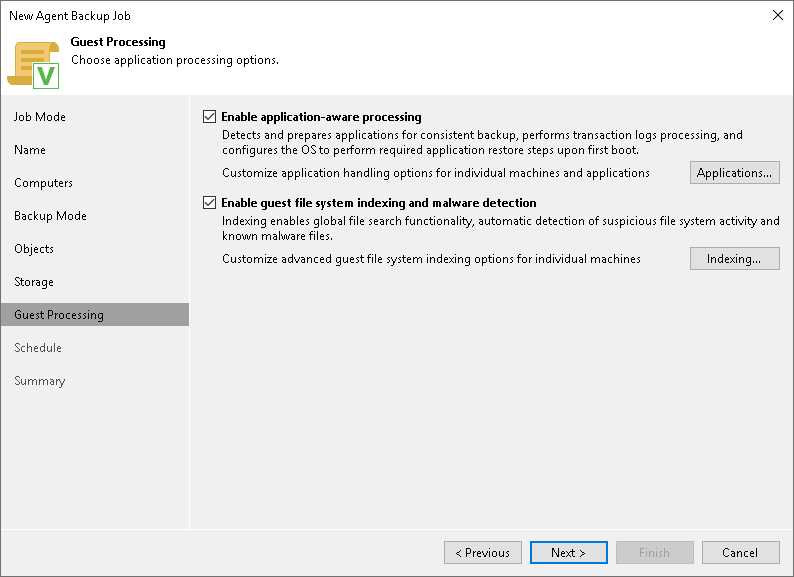

# Step 10. Specify Guest Processing Settings

In this article

For a Veeam Agent backup job managed by the backup server that protects Windows-based computers, you can enable the following guest OS processing settings:

* [Application-aware processing](agent_job_vss_general.md)
* [Transaction log handling for Microsoft SQL Server](agent_job_vss_sql.md)
* [Archived log handling for Oracle databases](agent_job_vss_oracle.md)
* [SharePoint account settings](agent_job_vss_sharepoint.md)
* [Use of pre-freeze and post-thaw scripts](agent_job_vss_scripts.md)
* [File indexing](agent_job_vss_indexing.md)

Page updated 12/6/2024

Page content applies to build 13.0.1.1071
