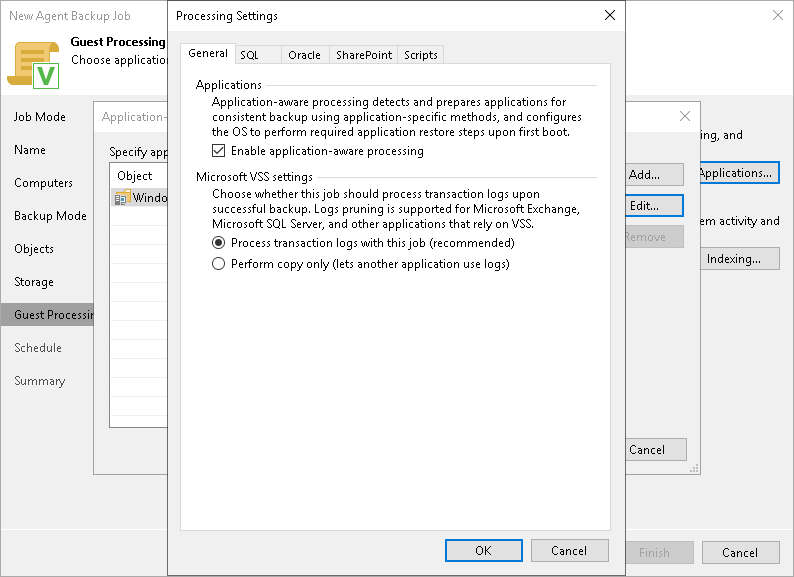

# Application-Aware Processing

In this article

If your computer runs VSS-aware applications, you can enable application-aware processing to create a transactionally consistent backup. The transactionally consistent backup guarantees proper recovery of applications without data loss.

To enable application-aware processing:

1. At the Guest Processing step of the wizard, make sure that the Enable application-aware processing check box is selected.
2. Click Applications.
3. In the displayed list, select a protection group or individual computer and click Edit.

To define custom settings for a computer added as a part of a protection group, you must include the computer to the list as a standalone object. To do this, click Add and choose the computer whose settings you want to customize. Then select the computer in the list and define the necessary settings.

1. On the General tab, in the Applications section, make sure that the Enable application-aware processing check box is selected.

You can clear this check box, for example, if you want to disable application-aware processing for a specific computer added to the backup job as a part of a protection group.

[For Microsoft SQL Server and Oracle] If you disable application-aware processing, Veeam Agent will not include information about databases in the backup. However, you can use Veeam Explorer for Microsoft SQL to locate a database file in the backup and restore the database.

1. [For Microsoft Exchange, Microsoft SQL Server and other applications that rely on VSS] In the Microsoft VSS settings section, specify if Veeam Agent for Microsoft Windows running on a protected computer must process transaction logs or copy-only backups must be created.

* Select Process transaction logs with this job if you want Veeam Agent for Microsoft Windows to process transaction logs.

[For Microsoft Exchange] With this option selected, Veeam Agent for Microsoft Windows will wait for backup to complete successfully, and then trigger truncation of transaction logs. If the backup job fails, the logs will remain untouched until the next backup job session.

[For Microsoft SQL Server and Oracle] You will have to specify settings for database log handling on the SQL and Oracle tabs of the Processing Settings window. For more information, see [Microsoft SQL Server Transaction Log Settings](agent_job_vss_sql.md) and [Oracle Archived Log Settings](agent_job_vss_oracle.md).

* Select Perform copy only if you use another tool to maintain consistency of the database state. Veeam Agent for Microsoft Windows will create a copy-only backup. The copy-only backup preserves the chain of full/differential backup files and transaction logs. After a copy-only backup, Veeam Agent does not trigger truncation of transaction logs. For more information, see [this Microsoft article](https://docs.microsoft.com/en-us/sql/relational-databases/backup-restore/copy-only-backups-sql-server?view=sql-server-2017).

|  |
| --- |
|  IMPORTANT |
| Consider the following:   * [For Microsoft Exchange] Veeam Agent for Microsoft Windows performs truncation of Microsoft Exchange transaction logs only if all disks that contain the Microsoft Exchange database are included in a volume-level backup job. * [For Microsoft SQL Server and Oracle] If both Microsoft SQL Server and Oracle Server are installed on the same guest OS, enable log backup settings for one application only: either Microsoft SQL Server or Oracle. If log backup is enabled for both applications, Veeam Backup & Replication will back up only Oracle transaction logs. Microsoft SQL Server transaction logs will not be processed. |

Page updated 11/12/2025

Page content applies to build 13.0.1.1071
