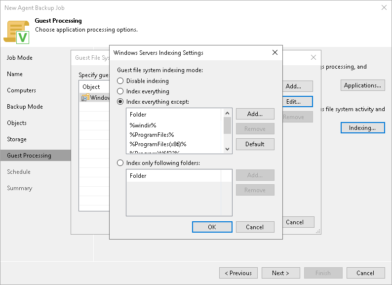

# File Indexing

You can instruct the backup job to create an index of files and folders on the protected computer OS during backup. If you enable the file indexing option, you will be able to search for individual files inside Veeam Agent backups and perform 1-click restore in Veeam Backup Enterprise Manager.

The collected data can also be used for malware detection if such an option is enabled in the malware detection settings. To learn more, see [Malware Detection](agents_malware_detection.md).

|  |
| --- |
| NOTE |
| File system indexing is optional. If you do not enable this option in the backup job settings, you will still be able to perform 1-click restore from the backup created with such backup job. For more information, see the [Preparing for File Browsing and Restore](https://helpcenter.veeam.com/docs/vbr/em/em_preparing_for_flr_physical.html?ver=13) section in the Veeam Backup Enterprise Manager User Guide. |

To specify file indexing options:

1. At the Guest Processing step of the wizard, select the Enable guest file system indexing and malware detection check box .
2. Click Indexing.
3. In the displayed list, select a protection group or individual computer and click Edit.
4. In the Windows indexing settings window, specify the indexing scope:

* Select Index everything if you want to index all files within the backup scope that you have specified at the [Backup mode](agent_job_mode.md) step of the wizard. Veeam Agent for Microsoft Windows will index all files that reside:

* On the protected computer OS (for entire computer backup)
* On the volumes that you have specified for backup (for volume-level backup)
* In the folders that you have specified for backup (for file-level backup)

* Select Index everything except if you want to index all files on the protected computer OS except those defined in the list. By default, system folders are excluded from indexing. You can add or delete folders using the Add and Remove buttons on the right. You can also use system environment variables to form the list, for example: %windir%, %Program Files% and %Temp%.

To reset the list of folders to its initial state, click Default.

* Select Index only following folders to define folders that you want to index. You can add or delete folders to index using the Add and Remove buttons on the right. You can also use system environment variables to form the list, for example: %windir%, %Program Files% and %Temp%.

