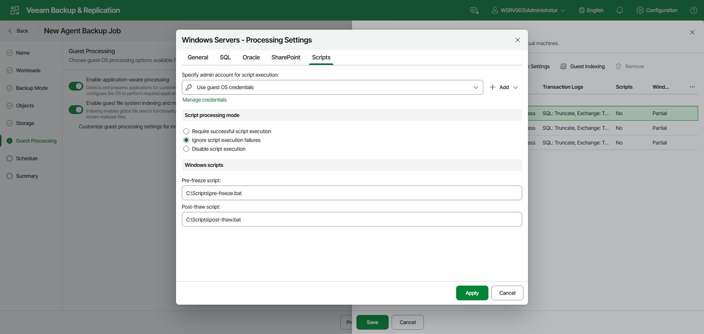

# Pre-Freeze and Post-Thaw Scripts

Before you configure script execution settings, review the considerations and limitations in the [Backup Job and Snapshot Scripts](agents_backup_windows_scripts.md) section.

If you plan to back up data of applications that do not support VSS, you can specify what scripts Veeam Agent for Microsoft Windows must use to quiesce the OS on the protected computer. The pre-freeze script quiesces the file system and application data to bring the OS to a consistent state before Veeam Agent for Microsoft Windows requests the creation of a VSS snapshot. After the VSS snapshot is created, the post-thaw script brings the file system and applications to their initial state.

To specify pre-freeze and post-thaw scripts for the job:

1. At the Guest Processing step of the wizard, make sure that the Enable application-aware processing toggle is on.
2. Click Customize.
3. In the Customize Guest Processing Settings window, select the check box next to the protection group or individual computer and click Application Settings on the toolbar.
4. In the Processing Settings window, open the Scripts tab.
5. From the Specify admin account for script execution drop-down list, select a user account that Veeam Agent for Microsoft Windows will use to run pre-freeze and post-thaw scripts. This account must be a Microsoft Windows user account or a Group Managed Service Account (gMSA).

If you have not set up credentials beforehand, click the Manage credentials link or click Add on the right to add credentials.

By default, the Use guest OS credentials option is selected. With this option selected, Veeam Agent for Microsoft Windows will run pre-freeze and post-thaw scripts under the account that you have specified for the protected computer in the protection group settings.

1. In the Script processing mode section, specify the scenario for scripts execution:

* Select Require successful script execution if you want Veeam Agent for Microsoft Windows to stop the backup process if the script fails.
* Select Ignore script execution failures if you want to continue the backup process even if script errors occur.
* Select Disable script execution if you do not want to run scripts.

1. In the Windows scripts section, in the Pre-freeze script and Post-thaw script fields, specify the path to executable files on the backup server.

During the backup job session, Veeam Backup & Replication uploads the scripts to the C:\ProgramData\Veeam\ScriptFiles\Upload\<backup job ID>\<script type>\ folder on each Veeam Agent computer included in the backup job. On each protected computer, Veeam Agent copies the scripts to the C:\ProgramData\Veeam\ScriptFiles\<backup job ID>\<script type>\ folder and executes them from that location under the user whose access credentials are specified in the backup job settings.

Page updated 2026-07-15

