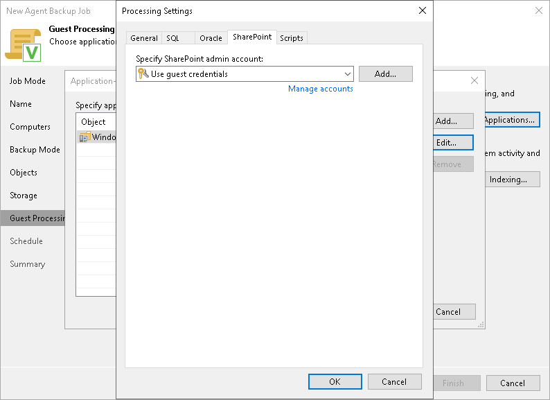

# Microsoft SharePoint Account Settings

In this article

If you back up Microsoft SharePoint, you must specify a user account that has enough permissions on the application:

1. At the Guest Processing step of the wizard, make sure that the Enable application-aware processing check box is selected.
2. Click Applications.
3. In the displayed list, select a protection group or individual computer and click Edit.
4. In the Processing Settings window, click the SharePoint tab.
5. From the Specify SharePoint admin account list, select a user account that Veeam Agent for Microsoft Windows will use to connect to the SharePoint application. If you have not set up credentials beforehand, click the Manage accounts link or click Add on the right to add credentials.

By default, the Use guest credentials option is selected in the list. With this option selected, Veeam Agent for Microsoft Windows will connect to the SharePoint application under the account that you have specified for the protected computer in the protection group settings.

Page updated 11/28/2023

Page content applies to build 13.0.1.1071
