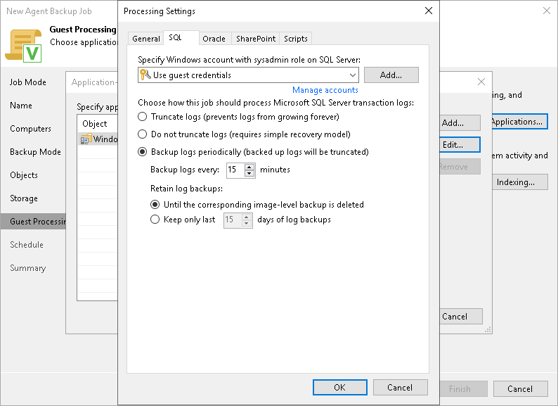

# Microsoft SQL Server Transaction Log Settings

|  |
| --- |
| IMPORTANT |
| If the Microsoft OLE DB Driver 19 is installed on the SQL server host, consider the following:   * If the mandatory or strict encryption is enabled for the SQL server, you must additionally specify settings for connection to the SQL server using registry values. To learn more, [contact Veeam Customer Support](https://www.veeam.com/support.html). * If the SQL server instances have different encryption settings, Veeam Agent will back up only those whose settings match the settings specified in the registry values. * If an earlier version of the Microsoft OLE DB Driver is also installed on the SQL server host, Veeam Agent will still use the Microsoft OLE DB Driver 19 to connect to the SQL server. |

If you back up Microsoft SQL Server, you can specify how Veeam Agent for Microsoft Windows must process database transaction logs:

1. At the Guest Processing step of the wizard, make sure that the Enable application-aware processing check box is selected.
2. Click Applications.
3. In the displayed list, select a protection group or individual computer and click Edit.
4. In the Microsoft VSS settings section, select Process transaction logs with this job.
5. In the Processing Settings window, click the SQL tab.
6. To specify a user account that Veeam Agent will use to connect to the Microsoft SQL Server, select from the Specify Windows account with sysadmin role on SQL Server list a user account that has access permissions on the database. This account must be a Microsoft Windows user account or a Group Managed Service Account (gMSA) with roles and permissions as specified in section [Permissions for Guest Processing](agents_permissions.md#guest).

Keep in mind that you cannot use Microsoft SQL Server accounts (for example, the SA account) to connect to the database.

By default, the Use guest credentials option is selected in the list. With this option selected, Veeam Agent will connect to the Microsoft SQL Server under the account that you have specified for the protected computer in the protection group settings.

If you have not set up credentials beforehand, click the Manage accounts link or click Add on the right to add credentials.

1. Specify how transaction logs must be processed. You can select one of the following options:

* Select Truncate logs to truncate transaction logs after successful backup. Veeam Agent will wait for the backup to complete successfully and then truncate transaction logs. If the backup job fails, the logs will remain untouched until the next backup job session.

* Select Do not truncate logs to preserve transaction logs. When the backup job completes, Veeam Agent will not truncate transaction logs.

We recommend that you enable this option only for databases with log truncation managed by a database administrator and databases that use the Simple recovery model. If you enable this option for databases that use the Full or Bulk-logged recovery model, transaction logs may grow large and consume all disk space. In this case, the database administrator must take care of transaction logs.

* Select Backup logs periodically to back up transaction logs with Veeam Agent. Veeam Agent will periodically copy transaction logs to the backup location and store them together with the image-level backup. During the backup job session, transaction logs will be truncated.

For more information, see the [Microsoft SQL Server and Oracle Logs Backup](https://helpcenter.veeam.com/docs/agentforwindows/userguide/sql_backup.html?ver=13) section in the Veeam Agent for Microsoft Windows User Guide.

If you have selected to back up transaction logs with Veeam Agent for Microsoft Windows, you must specify settings for transaction logs backup:

1. In the Backup logs every <N> minutes field, specify the frequency for transaction logs backup. By default, transaction logs are backed up every 15 minutes. The maximum log backup interval is 480 minutes.
2. In the Retain log backups section, specify retention policy for transaction logs stored in the backup location.

* Select Until the corresponding image-level backup is deleted to apply the same retention policy for image-level backups and transaction log backups.
* Select Keep only last <N> days of log backups to keep transaction logs for a specific number of days. By default, transaction logs are kept for 15 days. If you select this option, you must make sure that retention for transaction logs is not greater than retention for the image-level backup. For more information, see the [Retention for Database Log Backups](https://helpcenter.veeam.com/docs/agentforwindows/userguide/sql_backup_retention.html?ver=13) section in the Veeam Agent for Microsoft Windows User Guide.

