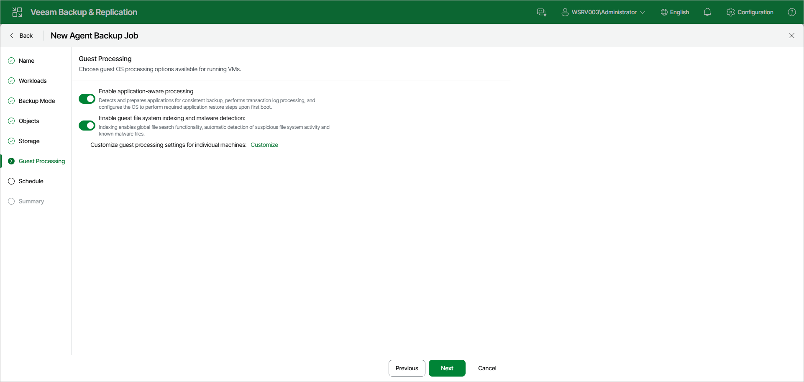

# Step 9. Specify Guest Processing Settings

At the Guest Processing step of the wizard, choose guest OS processing options for the Veeam Agent computers added to the backup job. You can enable the following options:

* Enable application-aware processing — detects and prepares applications for consistent backup, performs transaction log processing, and configures the OS to perform required application restore steps upon first boot.
* Enable guest file system indexing and malware detection — indexing enables global file search functionality, automatic detection of suspicious file system activity and known malware files.

To configure guest processing settings for individual computers, click the Customize link. In the Customize Guest Processing Settings window, select a protection group or individual computer and use the toolbar to configure the settings:

* Application Settings — opens the Processing Settings window with per-computer application-aware processing, VSS, SQL, Oracle, SharePoint, and script settings.
* Guest Indexing — opens the per-computer guest file system indexing settings.
* Add — adds an individual computer to the list as a standalone object so you can define custom settings for it, even if it is added to the backup job as a part of a protection group.
* Remove — removes a custom entry that you have added.

For more information about the individual guest processing settings, see:

* [Application-aware processing](agent_job_vss_general_web.md)
* [Transaction log handling for Microsoft SQL Server](agent_job_vss_sql_web.md)
* [Archived log handling for Oracle databases](agent_job_vss_oracle_web.md)
* [SharePoint account settings](agent_job_vss_sharepoint_web.md)
* [Use of pre-freeze and post-thaw scripts](agent_job_vss_scripts_web.md)
* [File indexing](agent_job_vss_indexing_web.md)

Page updated 2026-07-15

