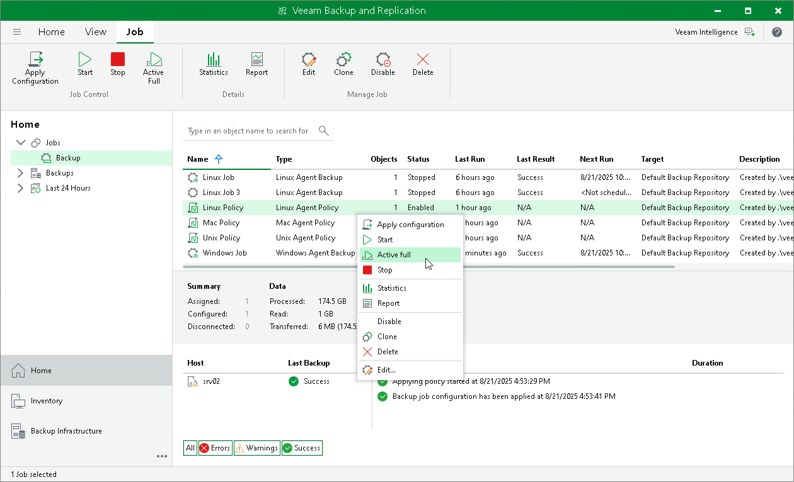
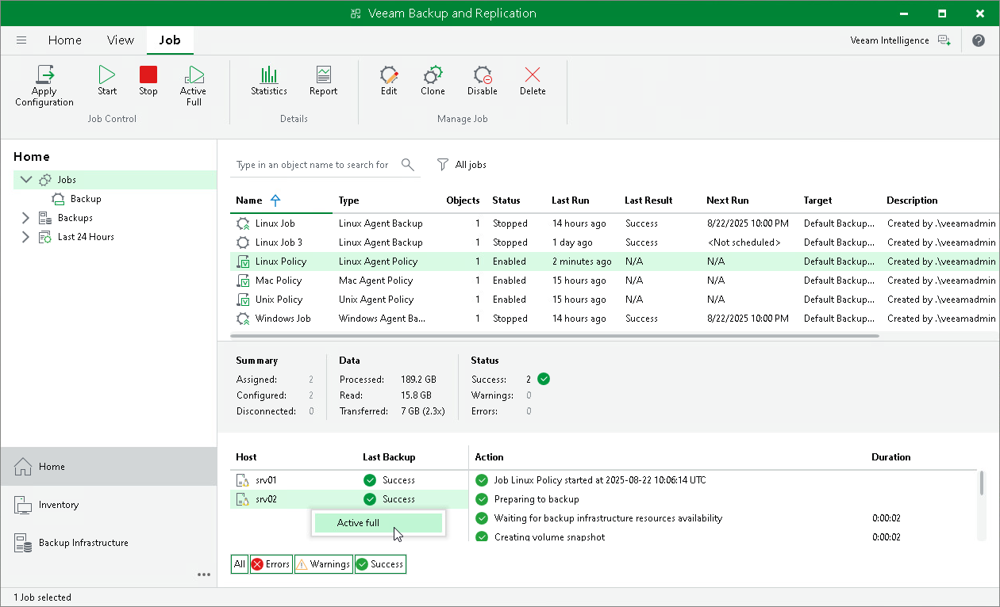

# Performing Active Full Backup

In this article

You can create an ad-hoc full backup — active full backup, and add it to the backup chain on the backup repository. The active full backup resets the backup chain. All subsequent incremental backups use the active full backup as a starting point. The previously used full backup will remain on the backup repository until it is removed from the backup chain according to the retention policy.

When you start active full backup for a backup policy, Veeam Backup & Replication applies the policy to Veeam Agent computers and sends a command to perform active full backup on these computers. Veeam Backup & Replication does not check whether connection to Veeam Agent computers is active at the time when the command is sent. Keep in mind that the active full backup operation will be performed only on those computers that received the command from the backup server.

Keep in mind that you cannot start active full backup for protection groups for pre-installed Veeam Agents and their members. Veeam Agent computers included in such protection groups will be skipped and Veeam Backup & Replication will display a warning message in a backup policy session statistics.

To perform active full backup on Veeam Agent computers added to the backup policy:

1. Open the Home view.
2. In the inventory pane, select Jobs.
3. In the working area, select the backup policy and click Active Full on the ribbon or right-click the policy and select Active full.

|  |
| --- |
| TIP |
| You can also create a full backup of an individual computer added to the backup policy. To learn more, see [Performing Active Full Backup for Individual Computer](#individ). |

Performing Active Full Backup for Individual Computer

To create an active full backup for an individual computer:

1. Open the Home view.
2. In the inventory pane, select Jobs.
3. In the working area, select the Veeam Agent backup policy.
4. In the bottom part of Veeam Backup & Replication, find the list of computers that are processed by the selected backup policy. In the list, right-click the computer and click Active full.

Keep in mind the following you will be able to create an active full backup for another computer in the same job only after active full backup is created for the selected computer.

Page updated 8/22/2025

Page content applies to build 13.0.1.1071
