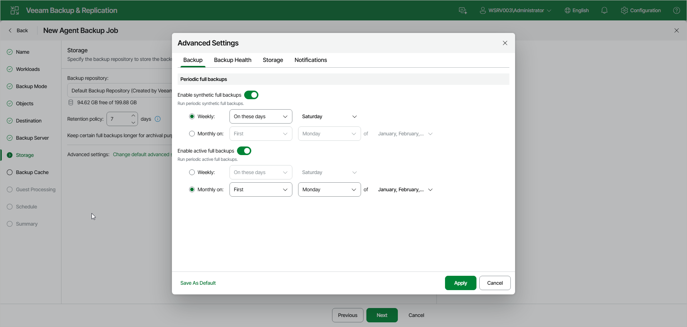

# Backup Settings

To specify settings for a backup chain created with the backup policy:

1. Open the Advanced Settings window at one of the following steps of the wizard:

* Storage — if you have selected to save backup files in a Veeam backup repository. Click Change default advanced settings.

* Local Storage — if you have selected to save backup files in a local storage of a Veeam Agent computer. Click Configure advanced settings.
* Shared Folder — if you have selected to save backup files in a network shared folder. Click Configure advanced settings.

1. In the Advanced Settings window, go to the Backup tab.
2. If you want to periodically create synthetic full backups, under Periodic full backups, turn on the Enable synthetic full backups toggle. Then select Weekly or Monthly on and specify the scheduling settings in the drop-down lists.

|  |
| --- |
| NOTE |
| Synthetic full backup is not available for backup policies targeted at an object storage repository. |

1. If you want to periodically create active full backups, turn on the Enable active full backups toggle. Then select Weekly or Monthly on and specify the scheduling settings in the drop-down lists.

|  |
| --- |
| NOTE |
| Consider the following:   * Before scheduling periodic full backups, you must make sure that you have enough free space on the target location. For more information about periodic full backups, see the [Active Full Backup](https://helpcenter.veeam.com/docs/agentforwindows/userguide/active_full_backup.html?ver=13) and [Synthetic Full Backup](https://helpcenter.veeam.com/docs/agentforwindows/userguide/synthetic_full_backup.html?ver=13) sections in the Veeam Agent for Microsoft Windows User Guide. * If you schedule the active full backup and synthetic full backup on the same day, Veeam Agent for Microsoft Windows will perform only active full backup. Synthetic full backup will be skipped. |

Page updated 2026-07-16

