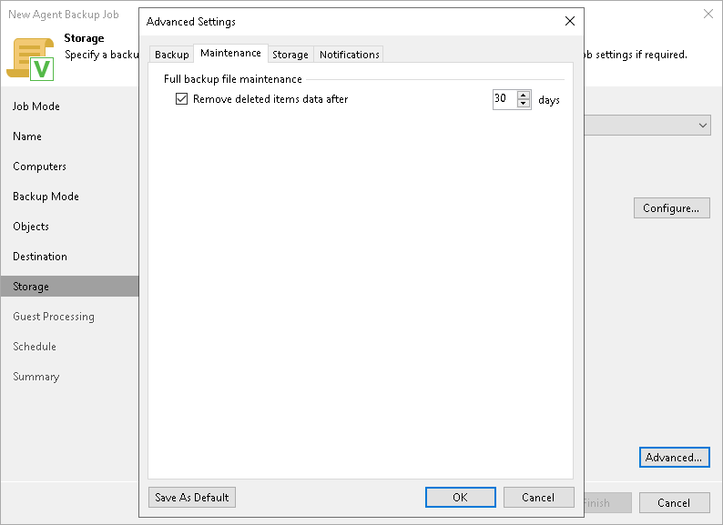

# Maintenance Settings

You can specify maintenance settings for a backup chain created with the Veeam Agent backup policy. Maintenance operations help make sure that the backup chain remains valid and consistent.

To specify maintenance settings for the backup policy:

1. In the Advanced Settings window, select the Maintenance tab.
2. On the Maintenance tab, select Remove deleted items data after and specify the number of days for which you want to keep the backup created with the backup job in the target location.

By default, the deleted items data retention period is 30 days. Do not set the deleted items retention period to 1 day or a similar short interval. In the opposite case, the backup job may work not as expected and remove data that you still require.

