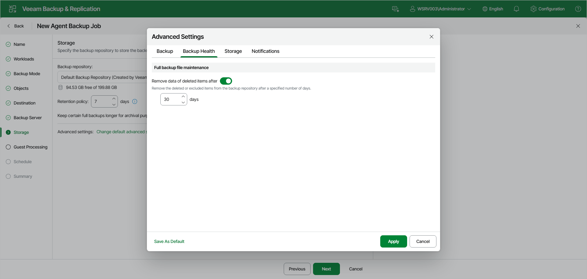

# Backup Health Settings

You can specify backup health settings for a backup chain created with the Veeam Agent backup policy. These operations help make sure that the backup chain remains valid and consistent.

To specify backup health settings for the backup policy:

1. At the Storage step of the wizard, click Change default advanced settings.
2. In the Advanced Settings window, go to the Backup Health tab.
3. Under Full backup file maintenance, turn on the Remove data of deleted items after toggle and specify the number of days for which you want to keep the backup created with the backup policy in the target location.

If Veeam Agent does not create new restore points for the backup, the backup will remain in the target location for the period that you have specified. When this period is over, the backup will be removed from the target location. For more information, see the [Retention Policy for Outdated Backups](https://helpcenter.veeam.com/docs/agentforlinux/userguide/retention_deleted_items.html?ver=13) section in the Veeam Agent for Linux User Guide.

By default, the deleted items data retention period is 30 days. Do not set the deleted items retention period to 1 day or a similar short interval. In the opposite case, the backup policy may work not as expected and remove data that you still require.

|  |
| --- |
| NOTE |
| The Remove data of deleted items after toggle is available only if you have selected the Veeam backup repository option at the [Destination](agent_policy_target_linux_web.md) step of the wizard. |

Page updated 2026-07-17

