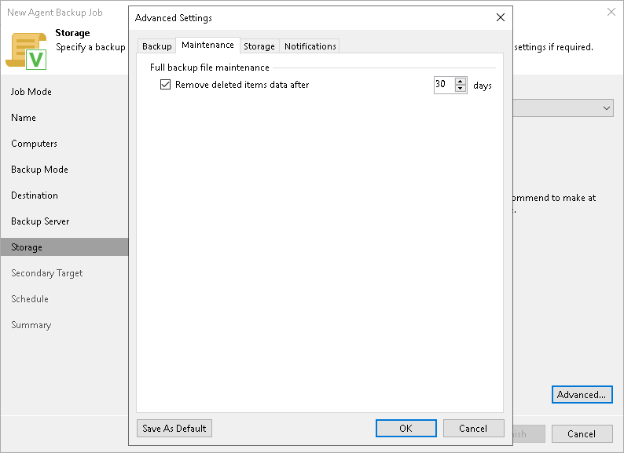

# Maintenance Settings

In this article

You can specify maintenance settings for a backup policy targeted at a Veeam backup repository. Maintenance operations help make sure that the backup chain remains valid and consistent.

To specify maintenance settings for the backup policy:

1. In the Advanced Settings window, select the Maintenance tab.

1. On the Maintenance tab, select Remove deleted items data after and specify the number of days for which you want to keep the backup created with the backup policy in the target location.

If Veeam Agent does not create new restore points for the backup, the backup will remain in the target location for the period that you have specified. When this period is over, the backup will be removed from the target location.

By default, the deleted items data retention period is 30 days. Do not set the deleted items retention period to 1 day or a similar short interval. Otherwise, the backup policy may not work as expected and remove data that you still require.

1. If you selected object storage as a target for your backup, Veeam Backup & Replication will display the setting that allows you to schedule a regular backup health check. To learn more, see [Scheduling Health Check](#hc).

Scheduling Health Check

When you store backup files in object storage, an automatic health check can help you avoid a situation when a restore point gets corrupted, making all dependent restore points corrupted, too. For more information, see [Health Check for Object Storage](https://helpcenter.veeam.com/docs/agentformac/userguide/backup_health_check.html).

To periodically perform a health check of the backup, do the following:

1. In the Advanced Settings window, select the Maintenance tab.
2. Select the Perform backup files health check check box.
3. Use the Monthly on or Weekly on selected days options to define the schedule for the health check of the backup in the repository.

Page updated 7/29/2025

Page content applies to build 13.0.1.1071
