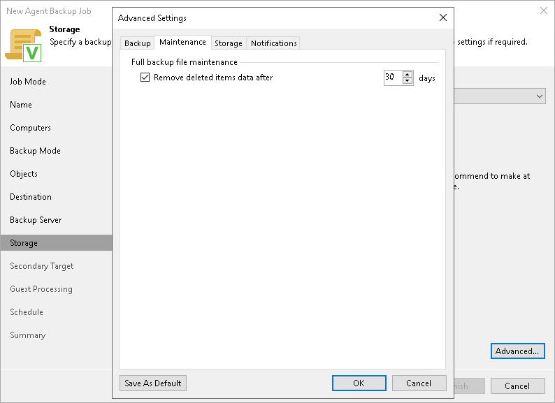

# Maintenance Settings

You can specify maintenance settings for a backup policy targeted at a Veeam backup repository. Maintenance operations help make sure that the backup chain remains valid and consistent.

To specify maintenance settings for the backup policy:

1. In the Advanced Settings window, select the Maintenance tab.
2. On the Maintenance tab, select the Remove deleted items data after check box and specify the number of days for which you want to keep the backup created with the backup policy in the target location.

If Veeam Agent does not create new restore points for the backup, the backup will remain in the target location for the period that you have specified. When this period is over, the backup will be removed from the target location.

By default, the deleted items data retention period is 30 days. Do not set the deleted items retention period to 1 day or a similar short interval. Otherwise, the backup policy may not work as expected and remove data that you still require.

