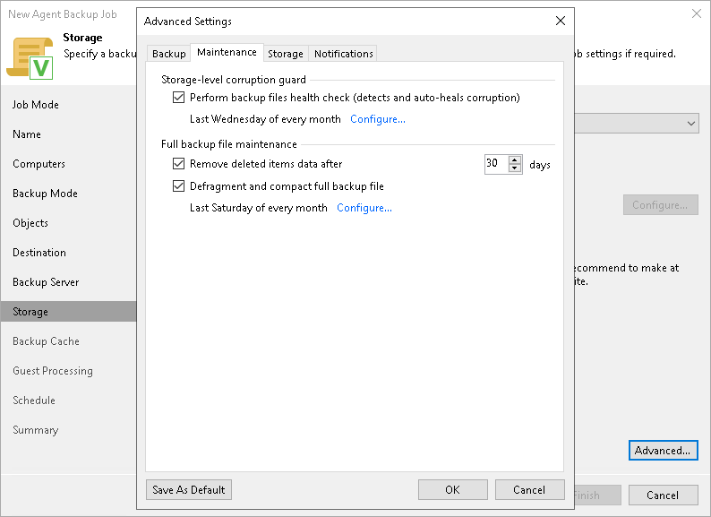

# Maintenance Settings

To specify maintenance settings for the backup policy:

1. Click Advanced at one of the following steps of the wizard:

* Storage — if you have selected to save backup files in a Veeam backup repository or cloud repository.

* Local Storage — if you have selected to save backup files in a local storage of a Veeam Agent computer.
* Shared Folder — if you have selected to save backup files in a network shared folder.

1. In the Advanced Settings window, click the Maintenance tab.
2. To periodically perform a health check for the latest restore point in the backup chain, in the Storage-level corruption guard section, select the Perform backup files health check check box. To specify the schedule for the health check, click Configure.

An automatic health check can help you avoid a situation where a restore point gets corrupted, making all dependent restore points corrupted, too. If during the health check Veeam Agent for Microsoft Windows or Veeam Backup & Replication detect corrupted data blocks in the latest restore point in the backup chain (or the restore point before the latest one if the latest restore point is incomplete), it will start the health check retry and transport valid data blocks from the Veeam Agent computer to the target location. The transported data blocks are stored to a new backup file or the latest backup file in the backup chain, depending on the data corruption scenario.

For Veeam Agent backup policies, the health check process is the same as for Veeam Agent backup jobs configured directly on a Veeam Agent computer. For more information, see the [Health Check for Backup Files](https://helpcenter.veeam.com/docs/agentforwindows/userguide/backup_health_check.html?ver=13) section in the Veeam Agent for Microsoft Windows User Guide.

For Veeam Agent backup policies, the health check process is the same as for Veeam Agent backup jobs configured directly on a Veeam Agent computer. For more information, see the [Health Check for Backup Files](https://helpcenter.veeam.com/docs/agentforwindows/userguide/backup_health_check.html?ver=13) section in the Veeam Agent for Microsoft Windows User Guide.

|  |
| --- |
| NOTE |
| For object storage, Veeam Agent offers a special health check mechanism as default. To run the health check for object storage, enable the Perform backup files health check option in the Storage-level corruption guard section and specify the health check schedule.  You can also switch from the health check for object storage to the standard health check. To do so, select the Verify content of each object in backup check box in the backup policy settings. Keep in mind that enabling this setting may result in additional charges from your object storage provider. |

If Veeam Agent does not create new restore points for the backup, the backup will remain in the target location for the period that you have specified. When this period is over, the backup will be removed from the target location. For more information, see the [Retention Policy for Outdated Backups](https://helpcenter.veeam.com/docs/agentforwindows/userguide/retention_deleted_items.html?ver=13) section in the Veeam Agent for Microsoft Windows User Guide.

By default, the deleted items data retention period is 30 days. Do not set the deleted items retention period to 1 day or a similar short interval. In the opposite case, the backup policy may work not as expected and remove data that you still require.

|  |
| --- |
| NOTE |
| The Remove deleted items data after option is not available if you configure a backup policy and have selected the Local storage or Shared folder option at the [Destination](agent_policy_win_destination.md) step of the wizard. |

1. To periodically compact a full backup, select the Defragment and compact full backup file check box. To specify the schedule for the compact operation, click Configure. During the compact operation, data blocks from the full backup file are copied to a new empty file. As a result, the full backup file gets defragmented, and the speed of reading from and writing to the backup file increases.

|  |
| --- |
| NOTE |
| The Defragment and compact full backup file option is not available for backup policies targeted at object storage. |

If the full backup file contains data blocks for deleted drives, Veeam Agent for Microsoft Windows will remove these data blocks. For more information, see the [Compact of Full Backup File](https://helpcenter.veeam.com/docs/agentforwindows/userguide/backup_compact_file.html?ver=13) section in the Veeam Agent for Microsoft Windows User Guide.

|  |
| --- |
| NOTE |
| Consider the following:   * If you want to periodically compact a full backup, you must make sure that you have enough free space in the target location. For the compact operation, the amount of free space must be equal to or more that the size of the full backup file. * In contrast to the compact operation for a VM backup, during compact of a full Veeam Agent backup file, Veeam Backup & Replication does not perform the data take out operation. If the full backup file contains data for a computer that has only one restore point and this restore point is older than 7 days, Veeam Backup & Replication will not extract data for this computer to a separate full backup file. |

