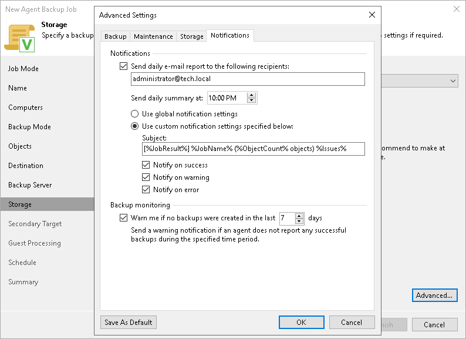

# Notification Settings

You can specify email notification settings for the backup policy. If you enable notification settings, Veeam Backup & Replication will send a daily email report with backup policy statistics to a specified email address. The report contains cumulative statistics for backup policy sessions performed for the last 24-hour period on computers to which the backup policy is applied.

|  |
| --- |
| NOTE |
| Email reports with backup policy statistics will be sent if you configure global email notification settings in Veeam Backup & Replication. For more information, see [Configuring Global Email Notification Settings](general_email_notifications.md).  After you enable notification settings for the backup policy, Veeam Backup & Replication will send reports with the backup policy statistics to email addresses specified in global email notification settings and email addresses specified in the backup policy settings. |

To specify notification settings for the backup policy:

1. In the Advanced Settings windows, select the Notifications tab.
2. On the Notifications tab, select Send daily e-mail report to the following recipients and specify a recipient’s email address in the field below. You can enter several addresses separated by a semicolon.
3. In the Send daily summary at field, specify the time when Veeam Backup & Replication must send the email notification for the backup policy. Veeam Backup & Replication will send the report daily at the specified time.
4. You can choose to use global notification settings or specify custom notification settings.

* To receive a typical notification for the backup policy, select Use global notification settings. In this case, Veeam Backup & Replication will apply to the backup policy global email notification settings specified for the backup server. Veeam Backup & Replication will send the email report containing backup policy statistics at 8:00 AM daily.
* To configure a custom notification for the backup policy, select Use custom notification settings specified below. You can specify the following notification settings:

* In the Subject field, specify a notification subject. You can use the following variables in the subject: %Time% (completion time), %JobName%, %JobResult%, %ObjectCount% (number of machines in the backup policy) and %Issues% (number of machines in the backup policy that have been processed with the Warning or Failed status).
* Select the Notify on success, Notify on warning and Notify on error check boxes to receive email notification if the policy completes successfully, completes with a warning or fails.

1. In the Backup monitoring section, select the Warn me if no backups were created in the last <N> days check box and specify a number of days. In this case, Veeam Backup & Replication will display a warning message in a backup policy session statistics in case successful backups are not created for a specified number of days.

