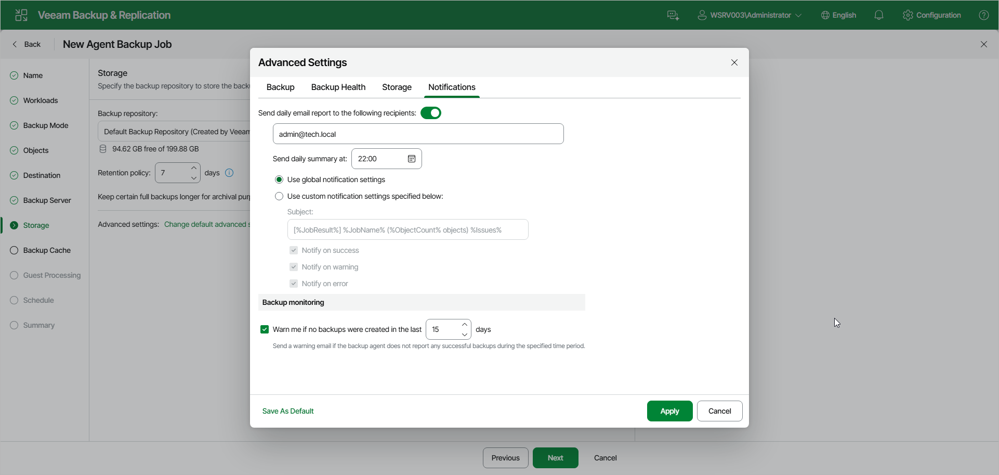

# Notification Settings

You can specify email notification settings for the backup policy. If you enable notification settings, Veeam Backup & Replication will send a daily email report with backup policy statistics to a specified email address. The report contains cumulative statistics for backup job sessions performed for the last 24-hour period on computers to which the backup policy is applied.

|  |
| --- |
| NOTE |
| Email reports with backup policy statistics will be sent if you configure global email notification settings in Veeam Backup & Replication. For more information, see [Configuring Global Email Notification Settings](general_email_notifications.md).  After you enable notification settings for the backup policy, Veeam Backup & Replication will send reports with the backup policy statistics to email addresses specified in global email notification settings and email addresses specified in the backup policy settings. |

To specify notification settings for the backup policy:

1. Open the Advanced Settings window at one of the following steps of the wizard:

* Storage — if you have selected to save backup files in a Veeam backup repository. Click Change default advanced settings.

* Local Storage — if you have selected to save backup files in a local storage of a Veeam Agent computer. Click Configure advanced settings.
* Shared Folder — if you have selected to save backup files in a network shared folder. Click Configure advanced settings.

1. In the Advanced Settings window, go to the Notifications tab.
2. Turn on the Send daily email report to the following recipients toggle and specify a recipient’s email address in the field below. You can enter several addresses separated by a semicolon.
3. In the Send daily summary at field, specify the time when Veeam Backup & Replication must send the email notification for the backup policy. Veeam Backup & Replication will send the report daily at the specified time.
4. You can choose to use global notification settings or specify custom notification settings.

* To receive a typical notification for the backup policy, select Use global notification settings. In this case, Veeam Backup & Replication will apply to the backup policy global email notification settings specified for the backup server.
* To configure a custom notification for the backup policy, select Use custom notification settings specified below. You can specify the following notification settings:

* In the Subject field, specify a notification subject. You can use the following variables in the subject: %Time% (completion time), %JobName%, %JobResult%, %ObjectCount% (number of machines in the backup policy) and %Issues% (number of machines in the backup policy that have been processed with the Warning or Failed status).
* Select the Notify on success, Notify on warning or Notify on error check boxes to receive email notification if the policy completes successfully, completes with a warning or fails.

1. Under Backup monitoring, select the Warn me if no backups were created in the last check box and specify a number of days. In this case, Veeam Backup & Replication will send a warning email if the backup agent does not report any successful backups during the specified time period.

Page updated 2026-07-16

