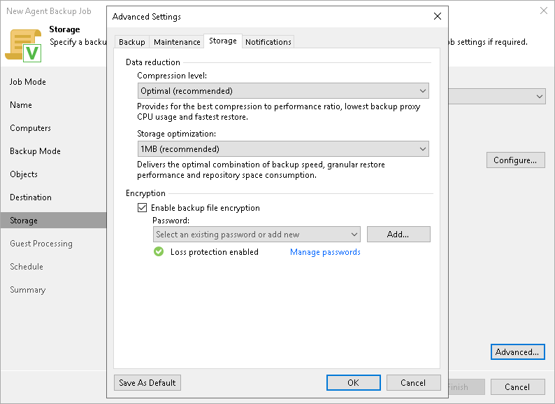

# Storage Settings

In this article

To specify storage settings for the Veeam Agent backup policy:

1. In the Advanced Settings window, select the Storage tab.
2. On the Storage tab, from the Compression level list, select a compression level for the backup: None, Dedupe-friendly, Optimal, High or Extreme. To learn more about the compression levels, see the [Data Compression](https://helpcenter.veeam.com/docs/agentforlinux/userguide/compression_deduplication.html?zoom_highlight=dedupe-friendly&ver=60) section in the Veeam Agent for Linux User Guide.
3. In the Storage optimization section, select what type of backup target you plan to use. Depending on the chosen storage type, Veeam Agent for Linux will use data blocks of different size to optimize the size of backup files and policy performance: 4 MB, 1 MB, 512 KB or 256 KB.

|  |
| --- |
| NOTE |
| If you change the storage optimization settings for the backup policy, new settings will not have any effect on previously created files in the chain. They will be applied to new files created after the settings were changed.  To apply new storage optimization settings in backup policies, you must create an active full backup after you change storage optimization settings. Veeam Backup & Replication will use the new block size for the active full backup and subsequent backup files in the backup chain. To learn about the active full backup, see [Performing Active Full Backup](agent_policy_active_full.md). |

1. To encrypt the content of backup files, select the Enable backup file encryption check box. In the Password field, select a password that you want to use for encryption. If you have not created the password beforehand, click Add or use the Manage passwords link to specify a new password. For more information, see [Password Manager](password_manager.md).

If the backup server is not connected to Veeam Backup Enterprise Manager, you will not be able to restore data from encrypted backups in case you lose the password. Veeam Backup & Replication will display a warning about it: Loss protection disabled. For more information, see [Decrypting Data Without Password](decrypt_without_pass.md).

|  |
| --- |
| NOTE |
| Consider the following:   * If you plan to encrypt the content of backup files, consider the limitations listed in the [Data Encryption Limitations](#encrypt_limits) subsection.  * You must encrypt the backup policy if you want to back up data to the Veeam Data Vault storage.  * You cannot use Key Management System (KMS) keys for data encryption with a Veeam Agent backup policy. To be able to use KMS keys, create a [backup job managed by the backup server](agent_job_create_win.md).   To learn more about KMS keys, see [Key Management System Keys](kms.md) section. |

Data Encryption Considerations and Limitations

If you plan to encrypt the content of the backup files, consider the following:

* Data encryption settings for Veeam Agent backup policies configured in Veeam Backup & Replication are stored in the Veeam Backup & Replication database.

For backup policies targeted at a Veeam backup repository, all data encryption operations are performed in Veeam Backup & Replication, too. Encryption settings are passed to a Veeam Agent computer only in case this computer is added to a backup policy targeted at a local drive of a protected computer or at an SMB network shared folder. Veeam Backup & Replication performs this operation when applying the backup policy to a protected computer.

* If you change a password for data encryption for an existing backup policy targeted at a Veeam backup repository without changing other backup policy settings, the process of applying the backup policy to a protected computer completes with a notification informing that the backup policy was not modified. This happens because data encryption settings for managed Veeam Agents are saved to the Veeam Backup & Replication database and are not passed to a Veeam Agent computer.
* If you enable or disable encryption for an existing Veeam Agent backup policy, during the next session Veeam Agent will create a full backup file. The created full backup file and subsequent incremental backup files in the backup chain will be encrypted with the specified password.
* Encryption is not retroactive. If you enable encryption for an existing backup policy, Veeam Agent will encrypt the backup chain starting from the next restore point created with this policy.
* When you enable data encryption for a backup policy, Veeam Backup & Replication uses the specified password to encrypt backups of all Veeam Agent computers added to the backup policy. A Veeam Agent computer user can restore data from the backup of this computer without providing a password to decrypt backup. To restore data from a backup of another computer in this backup policy, a user must provide a password specified in the backup policy settings.

This scenario differs from the same scenario in earlier versions of Veeam Backup & Replication where all backups created for Veeam Agent computers in the backup policy could be accessed from any computer in the backup policy without providing a password.

To learn more about data encryption in Veeam Backup & Replication, see [Data Encryption](data_encryption.md).

Page updated 11/14/2025

Page content applies to build 13.0.1.1071
