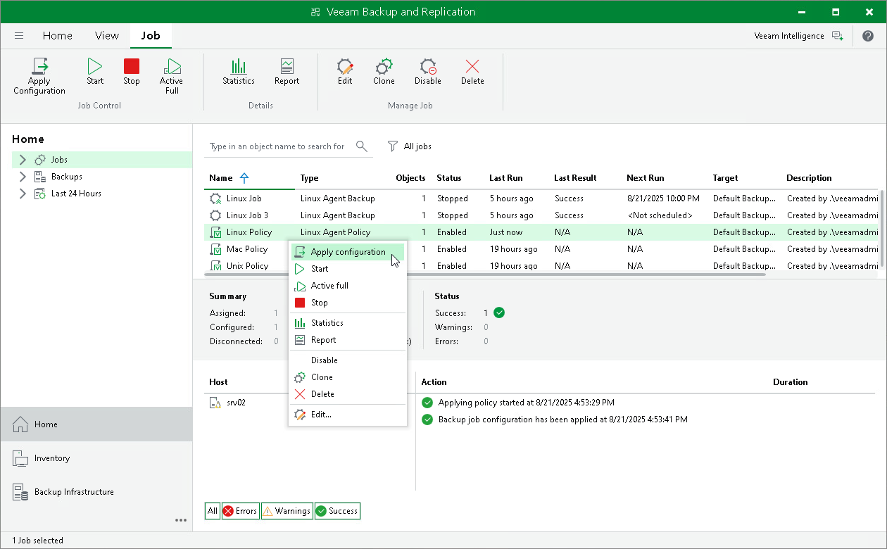

# Applying Backup Policy to Protected Computers

To configure individual Veeam Agent backup jobs on protected computers added to a backup policy, Veeam Backup & Replication applies settings of the backup policy to these computers. This operation is performed automatically at the time when the backup policy is created and at the process of automatic protection group rescan. You can also apply backup policy settings manually at any time. This may be required, for example, in case one or more protected computers could not be accessed over the network at the time when the backup policy was created.

To assign a backup policy to protected computers:

1. Open the Home view.
2. In the inventory pane, select Jobs.
3. In the working area, select the backup policy and click Apply Configuration on the ribbon or right-click the policy and select Apply configuration.

Keep in mind that Veeam Backup & Replication does not apply backup policy to protection groups for pre-installed Veeam Agents and their members immediately. Veeam Agents installed on computers included in such protection groups connect to Veeam Backup & Replication every 6 hours and get updated backup policy settings. If a backup policy is targeted at the Veeam backup server and the backup policy session is scheduled earlier than the next connection to Veeam Backup & Replication, this backup policy will get updated backup policy settings at the next session start.

|  |
| --- |
| TIP |
| If necessary, you can synchronize Veeam Agent with Veeam Backup & Replication running a command from the Veeam Agent computer. To learn more, see [Backup Policy Application Methods](agents_policy_apply.md). |

