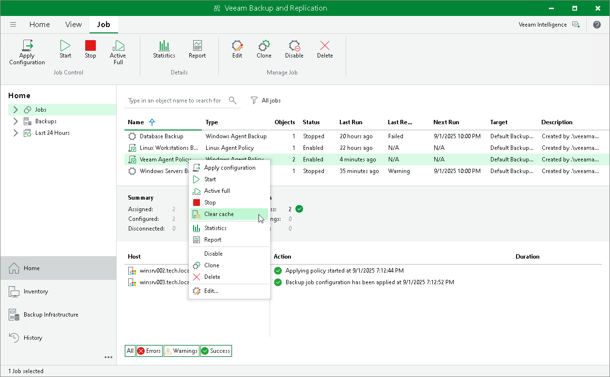

# Clearing Backup Cache

You can use the Veeam backup console to delete restore points from the backup cache on computers added to the backup policy. This operation may be required, for example, if the backup cache contains one or more restore points, and the backup chain in the target location has changed prior to the time when Veeam Agent starts uploading restore points to the target location.

Keep in mind that the clear cache operation is available only for computers that are protected with Veeam Agent for Microsoft Windows and are members of any protection group excluding protection group for pre-installed Veeam Agents.

When you perform the clear cache operation, Veeam Backup & Replication applies the policy to Veeam Agent computers and sends a command to delete restore points from the backup cache on these computers. Veeam Backup & Replication does not check whether connection to Veeam Agent computers is active at the time when the command is sent. Keep in mind that the operation will be performed only on those computers that received the command from the backup server.

To learn more, see [Backup Cache](agents_backup_cache.md).

To clear the backup cache on Veeam Agent computers added to the backup policy:

1. Open the Home view.
2. In the inventory pane, select Jobs.
3. In the working area, select the backup policy, press and hold the [Ctrl] key, right-click the backup policy and select Clear cache.

