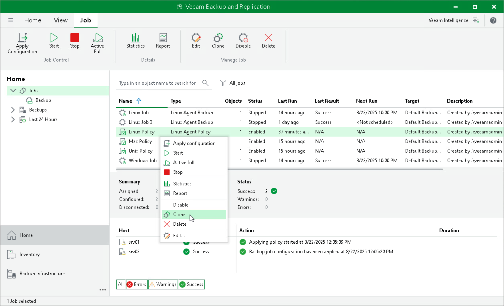
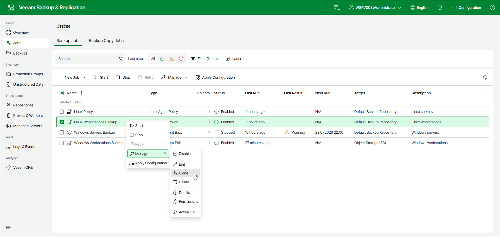

# Cloning Backup Policy

You can clone backup policies configured in Veeam Backup & Replication. For example, you may want to configure a backup policy that will be used as a ‘policy template’, and use this policy to create multiple policies with similar settings.

You can clone a backup policy in one of the following ways:

* [Using Veeam Backup & Replication Console](#console)
* [Using Veeam Backup & Replication Web UI](#webui)

Cloning Backup Policy Using Veeam Backup & Replication Console

To clone a backup policy:

1. Open the Home view.
2. In the inventory pane, select Jobs.
3. In the working area, select the backup policy and click Clone on the ribbon or right-click the backup policy and select Clone.
4. After a backup policy is cloned, you can edit all its settings, including the job name.

Cloning Backup Policy Using Veeam Backup & Replication Web UI

To clone a backup policy:

1. In the management pane, click Jobs.
2. Select the check box next to the necessary backup policy, and from the Manage drop-down list, select Clone. Alternatively, right-click the policy and click Manage > Clone.
3. After a backup policy is cloned, you can edit all its settings, including the job name.

Page updated 2026-07-29

