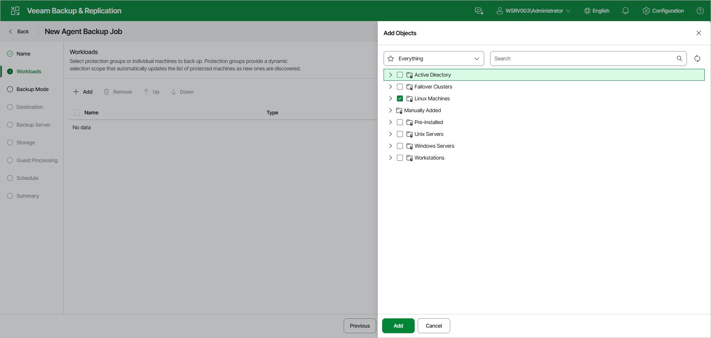

# Step 4. Select Computers to Back Up

At the Workloads step of the wizard, select protection groups and individual computers whose data you want to back up with the Veeam Agent backup policy.

|  |
| --- |
| NOTE |
| In the Veeam Backup & Replication web UI, you can add only protection groups and computers that are members of existing protection groups. To add a computer that is not a member of any protection group, use the Veeam Backup & Replication console. To learn more, see [Select Computers to Back Up](agent_policy_comp_linux.md). |

Policies with protection groups are dynamic in their nature. If Veeam Backup & Replication discovers a new computer in a protection group after the Veeam Agent backup policy is created, Veeam Backup & Replication will automatically update the policy settings to include the added computer.

|  |
| --- |
| TIP |
| If you used the Add to backup job > Linux > New job option to launch the New Agent Backup Job wizard, the list will already contain computers that you have selected to add to the policy. You can remove some computers from the policy or add new computers to the policy, if necessary. |

To add protection groups and individual computers to the Veeam Agent backup policy:

1. On the toolbar, click Add.
2. In the Add Objects window, do either of the following:

* To add an entire protection group, select the check box next to the protection group.
* To add individual computers from a protection group, expand the protection group and select the check boxes next to the necessary computers.

To quickly find the necessary object, use the search field at the top of the Add Objects window, or the Everything drop-down list to filter the tree by object type.

1. Click Add to close the Add Objects window.

You can also modify the list of workloads in the following ways:

* To remove a protection group or computer from the list, select the check box next to it and click Remove on the toolbar.
* To change the processing order, select the check box next to a protection group or computer and click Up or Down on the toolbar.

Page updated 2026-07-16

