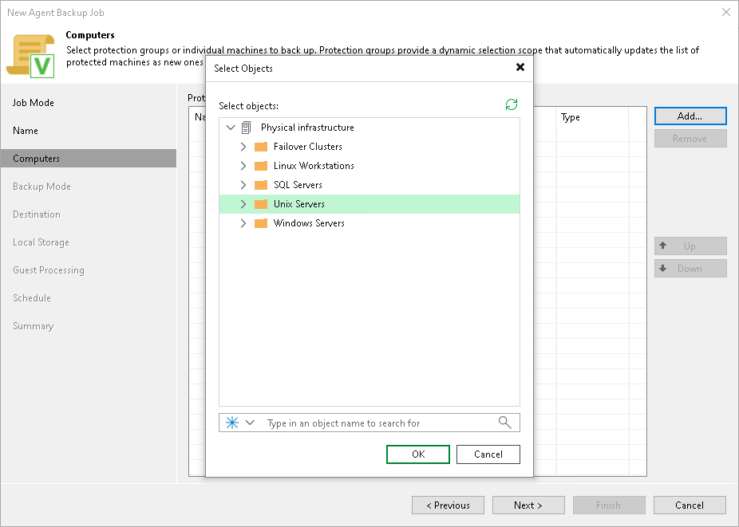

# Step 4. Select Computers to Back Up

At the Computers step of the wizard, select protection groups and individual computers that you want to back up.

You can add to the Veeam Agent backup policy one or more protection groups and individual computers added to inventory in the Veeam Backup & Replication console. If Veeam Backup & Replication discovers a new computer in a protection group after the Veeam Agent backup policy is created, Veeam Backup & Replication will automatically update the policy settings to include the added computer.

|  |
| --- |
| NOTE |
| If you used the Add to backup job > Unix > New job option to launch the New Agent Backup Job wizard, the Protected computers list will already contain computers that you have selected to add to the policy. You can remove some computers from the policy or add new computers to the policy, if necessary. |

To add protection groups and individual computers to the Veeam Agent backup policy:

1. Click Add.
2. In the Select Objects window, select one or more protection groups and computers in the list and click OK. You can press and hold the [Ctrl] key to select multiple objects at once.

To quickly find the necessary object, use the search field at the bottom of the Select Objects window.

1. Enter the object name or a part of it in the search field.
2. Click the Start search button on the right or press [Enter].

