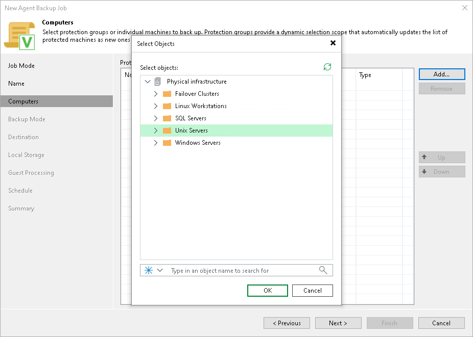

# Step 4. Select Computers to Back Up

At the Computers step of the wizard, select protection groups and individual computers that you want to back up.

You can add to the Veeam Agent backup policy one or more protection groups and individual computers added to inventory in the Veeam Backup & Replication console. If Veeam Backup & Replication discovers a new computer in a protection group after the Veeam Agent backup policy is created, Veeam Backup & Replication will automatically update the policy settings to include the added computer.

|  |
| --- |
| NOTE |
| If you used the Add to backup job > Unix > New job option to launch the New Agent Backup Job wizard, the Protected computers list will already contain computers that you have selected to add to the policy. You can remove some computers from the policy or add new computers to the policy, if necessary. |

Adding Protection Groups and Computers from Inventory

To add protection groups and individual computers to the Veeam Agent backup policy, do the following:

1. Click Add > Protection group.
2. In the Select Objects window, select one or more protection groups and computers, and click OK. To select multiple objects at once, press and hold [Ctrl] or [Shift].

To quickly find an object, use the search field at the bottom of the Select Objects window.

1. Enter the object name or part of it in the search field.
2. Click the Start search icon on the right, or press [Enter].

Adding New Computers

To add an individual machine that is not in the inventory, do the following:

1. Click Add > Individual computer.
2. In the Add Computer window, in the Host name or IP address field, enter the machine's fully qualified domain name (FQDN) or hostname, or IP address.
3. Select how Veeam Backup & Replication connects to the machine:

* Connect using admin credentials. In this case, from the Credentials list, select a user account with administrative permissions on the machine that you want to add to the protection group. Veeam Backup & Replication uses this account to connect to the protected machine and perform the necessary operations, such as uploading and installing Veeam Agent.

If you have not configured the credentials in advance, click Manage accounts or Add to add the credentials.

Veeam Backup & Replication supports the following credential types:

* Stored credentials — Select this type of credentials if you want Veeam Backup & Replication to use the specified user name and password for every connection to Veeam Agent.
* Single-use credentials — Select this type of credentials if you do not want Veeam Backup & Replication to store credentials in the configuration database. In this case, Veeam Backup & Replication uses the specified user name and password only for the first connection to Veeam Agent. After that, Veeam Backup & Replication uses Veeam Transport Service to communicate with the Veeam Agent machine.

* Connect using certificate-based authentication. [For IBM-AIX machines only] Select this option if you pre-installed Veeam Deployer Service on the IBM AIX machine that you want to add to the backup policy. In this case, Veeam Backup & Replication makes the initial connection to the protected machine using a temporary certificate. To learn more, see [Deploying Veeam Agent Using Veeam Deployment Kit](agents_deploy_deployer.md).

Page updated 2026-06-24

