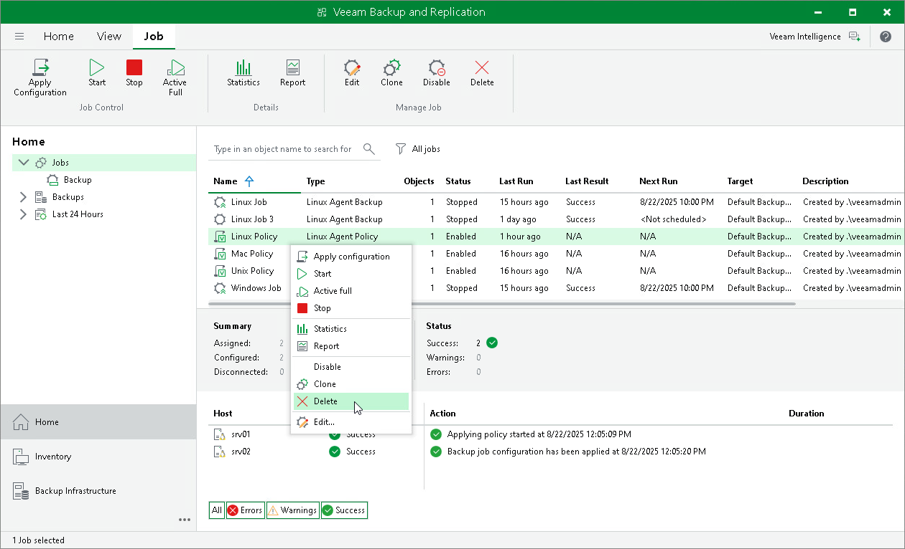

# Removing Backup Policy

In this article

You can permanently remove a Veeam Agent backup policy from Veeam Backup & Replication. When you remove a backup policy, Veeam Backup & Replication also removes child backup jobs configured on Veeam Agent computers. Backups created by these jobs remain on the target location.

To remove a Veeam Agent backup policy:

1. Open the Home view.
2. In the inventory pane, select Jobs.
3. In the working area, select the Veeam Agent backup policy and click Delete on the ribbon or right-click the policy and select Delete.

|  |
| --- |
| NOTE |
| [For computers with pre-installed Veeam Agents] The child jobs will continue running till the next synchronization with Veeam Backup & Replication. |

Page updated 8/22/2025

Page content applies to build 13.0.1.1071
