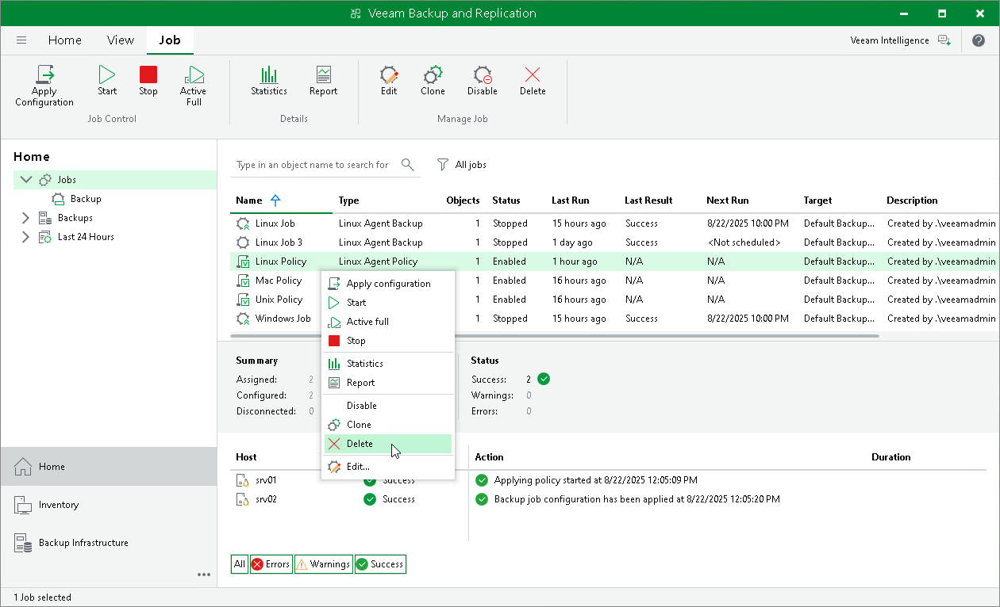
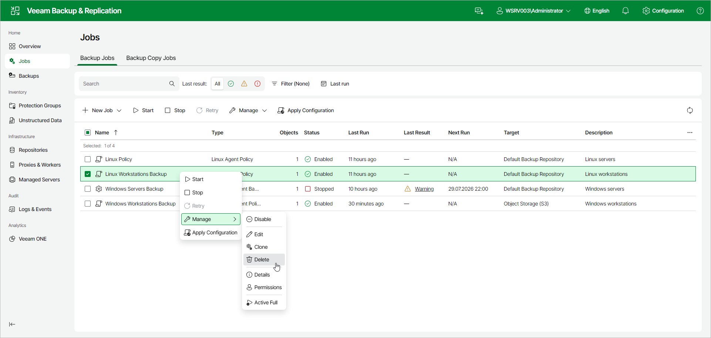

# Removing Backup Policy

You can permanently remove a Veeam Agent backup policy from Veeam Backup & Replication. When you remove a backup policy, Veeam Backup & Replication also removes child backup jobs configured on Veeam Agent computers. Backups created by these jobs remain on the target location.

|  |
| --- |
| NOTE |
| [For computers with pre-installed Veeam Agents] The child jobs will continue running till the next synchronization with Veeam Backup & Replication. |

You can remove a backup policy in one of the following ways:

* [Using Veeam Backup & Replication Console](#console)
* [Using Veeam Backup & Replication Web UI](#webui)

Removing Backup Policy Using Veeam Backup & Replication Console

To remove a Veeam Agent backup policy:

1. Open the Home view.
2. In the inventory pane, select Jobs.
3. In the working area, select the Veeam Agent backup policy and click Delete on the ribbon or right-click the policy and select Delete.

Removing Backup Policy Using Veeam Backup & Replication Web UI

To remove a Veeam Agent backup policy:

1. In the management pane, click Jobs.
2. Select the check box next to the necessary backup policy, and from the Manage drop-down list, select Delete. Alternatively, right-click the policy and click Manage > Delete.

Page updated 2026-07-29

