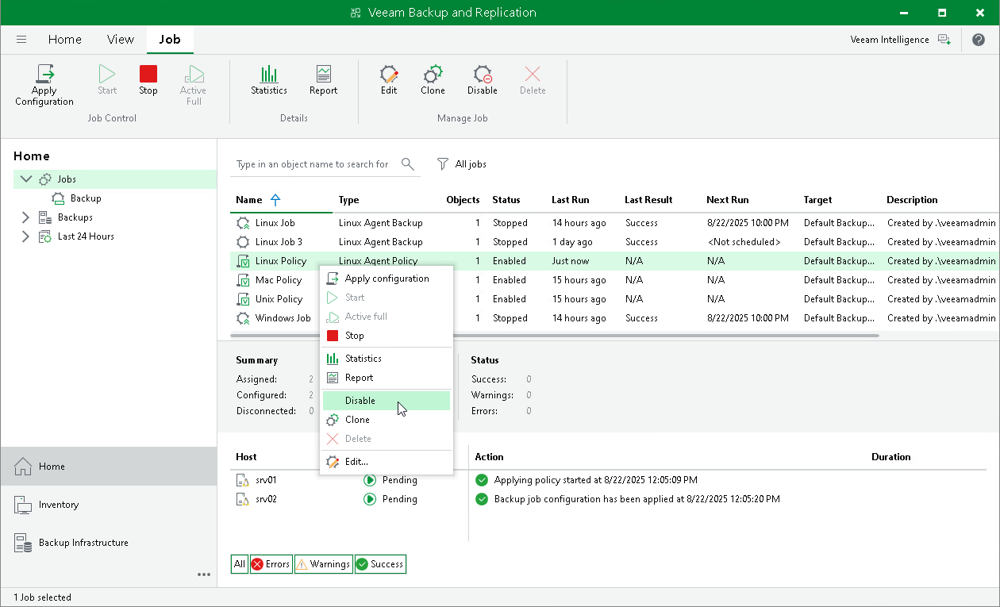

# Enabling and Disabling Backup Policy

You can temporary disable Veeam Agent backup policies configured in Veeam Backup & Replication. While a backup policy is in the disabled state, the following operations are not performed in the Veeam Agent management infrastructure:

* Veeam Backup & Replication does not apply backup policy settings to Veeam Agent computers.
* Veeam Agent running on a protected computer does not create backups on the backup repository.

If a user of a protected computer starts the Veeam Agent backup job manually or if the job starts by schedule, the job session will fail and report the "The job has been disabled by the Veeam Backup & Replication administrator" error. To let Veeam Agent for Microsoft Windows store backups to the backup repository again, you must enable the disabled policy and apply it to protected computers. To learn more, see [Applying Backup Policy to Protected Computers](agent_policy_apply.md).

To disable a Veeam Agent backup policy:

1. Open the Home view.
2. In the inventory pane, select Jobs.
3. In the working area, select the Veeam Agent backup policy and click Disable on the ribbon or right-click the policy and select Disable.

Keep in mind that Veeam Backup & Replication does not immediately disable a backup policy for protection groups for pre-installed Veeam Agents and their members. Veeam Agents installed on computers included in these groups connect to Veeam Backup & Replication every 6 hours and get updated backup policy settings. If a backup policy is targeted at the Veeam backup server and the next backup policy session is scheduled earlier than the next connection to Veeam Backup & Replication, this backup policy will get updated backup policy settings at the next session start.

|  |
| --- |
| TIP |
| If necessary, you can synchronize Veeam Agent with Veeam Backup & Replication running a command from the Veeam Agent computer. To learn more, see [Backup Policy Application Methods](agents_policy_apply.md). |

If you disabled a backup policy in the Veeam Backup & Replication console and this backup policy starts a new backup session targeted at the Veeam backup server before the next connection to Veeam Backup & Replication, this backup session and all automatic retries of this session will fail.

If you want to disable backup policy immediately, you must synchronize Veeam Agent with Veeam Backup & Replication from the Veeam Agent computer side manually. To learn more, see [Veeam Agent for Microsoft Windows Configuration](deploy_agent_windows.md#configure), [Veeam Agent for Linux Configuration](deploy_agent_linux.md#configure), or [Veeam Agent for Mac Configuration](deploy_agent_mac.md#configure).

To enable a disabled policy, select it in the list and click Disable on the ribbon once again.

