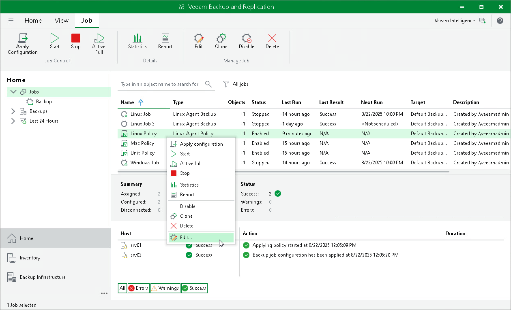

# Editing Backup Policy Settings

You can edit settings of a Veeam Agent backup policy at any time. For example, you may want to change the backup scope, target location or scheduling settings for Veeam Agent backup jobs running on protected computers. After you change settings of the backup policy, Veeam Backup & Replication applies the specified settings to Veeam Agent backup jobs configured on protected computers added to the policy.

|  |
| --- |
| NOTE |
| Consider the following:   * You cannot change the type of protected computers added to the job and the job mode (that is, change a Veeam Agent backup job to a backup policy and vice versa). * [For Veeam Agent backup jobs for Linux computers] You cannot change the backup mode from file-level to volume-level and vice versa. * If you change a password for data encryption without changing other backup policy settings, the process of applying the backup policy to a protected computer completes with a notification informing that the backup policy was not modified. This happens because data encryption settings for managed Veeam Agents are saved to the Veeam Backup & Replication database and are not passed to a Veeam Agent computer. |

To edit backup policy settings:

1. Open the Home view.
2. In the inventory pane, select Jobs.
3. In the working area, select the backup policy and click Edit on the ribbon or right-click the policy and select Edit.
4. Complete the steps of the Edit Agent Backup Job wizard to change the job settings as required.

