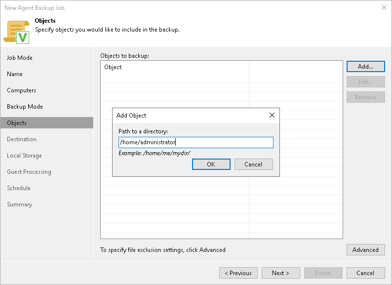
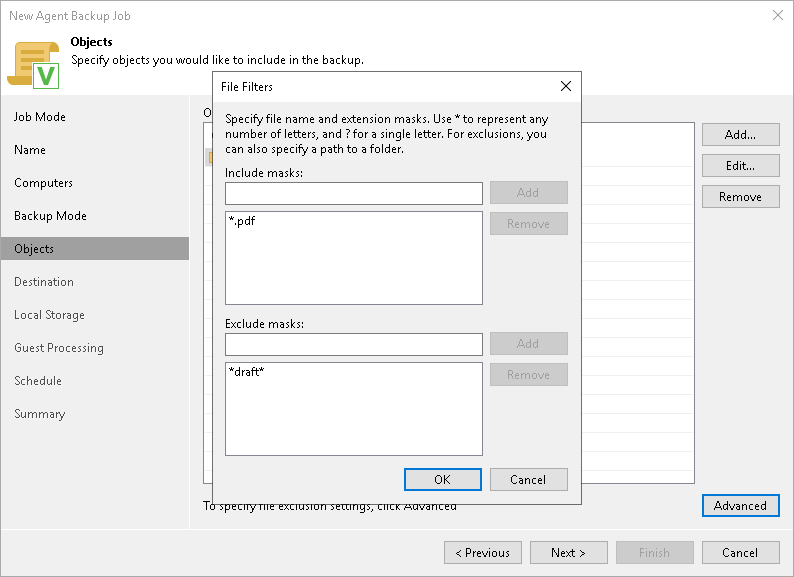

# Specifying Directories to Back Up

The Objects step of the wizard is available if you have chosen to create a file-level backup.

At this step of the wizard, you must specify the backup scope by defining what directories with files you want to include in the backup. The specified backup scope settings will apply to all computers that are added to the backup policy. If a specified directory does not exist on one or more computers in the policy, the policy will skip such folder on those computers and back up existing ones.

To specify directories to back up:

1. In the Choose directories to backup field, click Add.
2. In the Add Object window, type the path to a directory that you want to back up, for example, /home/user01, and click OK.

|  |
| --- |
| IMPORTANT |
| Veeam Agent does not support backup of bind mount points. You must specify the path to the original mount point instead. |

1. Repeat steps 1–2 for all directories that you want to back up.

|  |
| --- |
| TIP |
| If you want to back up the root directory and specify ‘/’ in the Path to a directory field, Veeam Agent will not automatically include into the backup scope the network file system mount points — for example, NFS or SMB network shared folders. To include such mount points, you need to specify paths to these mount points manually.  For example, you have a network file system mounted to the /home/media directory. If you add ‘/’ as an object to the backup scope, Veeam Agent will not back up the mounted file system. To back up the root directory and the mounted network file system, add the following objects to the backup scope:   * / * /home/media |

Configuring Filters

To include or exclude files of a specific type in/from the file-level backup, you can configure filters.

To configure a filter:

1. At the Objects step of the wizard, click Advanced.
2. Specify what files you want to back up:

* In the Include masks field, specify the names and masks for the files or file types you want to back up — for example, Report.pdf or \*filename\*. Veeam Agent will back up only the files or file types specified in the include masks. Other files in the backup scope will not be backed up.
* In the Exclude masks field, specify paths to directories, as well as names and masks for files or file types, you do not want to back up — for example, /home/user01, OldReports.tar.gz or \*.odt. Veeam Agent will back up all files in the backup scope except files that match the criteria defined in the exclude masks.

1. Click Add.
2. Repeat steps 2–3 for each mask that you want to add.

You can use a combination of include and exclude masks. Note that exclude masks have a higher priority than include masks. For example, you can specify masks in the following way:

* Include mask: \*.pdf
* Exclude mask: \*draft\*

Veeam Agent for Linux will include in the backup all files of the PDF format that do not contain draft in their names.

