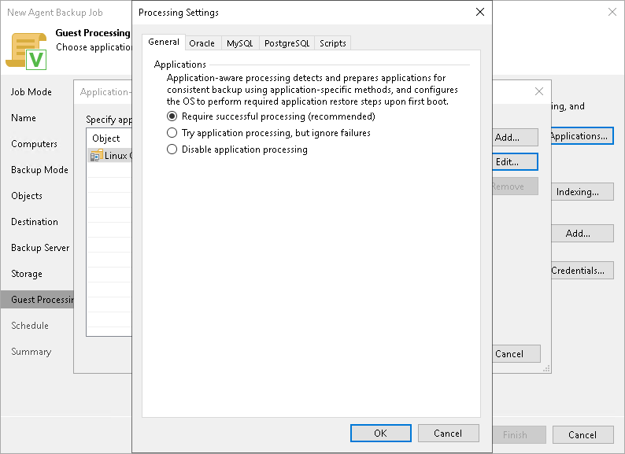

# Application-Aware Processing

If a computer protected with Veeam Agent for Linux runs an Oracle, MySQL or PostgreSQL database system, you can enable application-aware processing to create a transactionally consistent backup. The transactionally consistent backup guarantees proper recovery of databases without data loss.

Before You Begin

Before you start working on the General tab, check the following at the Guest Processing step of the wizard:

1. The Enable application-aware processing check box is selected.
2. In the Application-Aware Processing Options window, a necessary protection group or individual computer is added to the list.

For more information, see [Guest Processing Settings](agent_policy_guest_linux.md).

Configuring Application Processing Settings

1. At the Guest Processing step of the wizard, click Applications.
2. In the Application-Aware Processing Options window, select the necessary object and click Edit.
3. On the General tab, in the Applications section, specify the behavior scenario for application-aware processing:

* Select Require successful processing if you want Veeam Agent for Linux to process database systems. With this option selected, if an error occurs when processing a database or database instance, Veeam Agent for Linux will stop the backup process.

If you select this option, you will need to specify database processing settings. For more information, see [Oracle Processing Settings](agent_policy_guest_oracle_linux.md), [MySQL Processing Settings](agent_policy_guest_mysql_linux.md) and [PostgreSQL Processing Settings](agent_policy_guest_postgresql_linux.md).

* Select Try application processing, but ignore failures if you want Veeam Agent for Linux to process database systems. With this option selected, if an error occurs when processing a database or database instance, Veeam Agent for Linux will not stop the backup process. Instead, Veeam Agent for Linux will skip this database or database instance and proceed to the next one. Information about the skipped database or database instance will be displayed in a warning message in the policy session statistics. After the backup process is completed, you will be able to restore data from the backup and restore databases or database instances that were successfully processed during backup.

If you select this option, you will need to specify database processing settings. For more information, see [Oracle Processing Settings](agent_policy_guest_oracle_linux.md), [MySQL Processing Settings](agent_policy_guest_mysql_linux.md) and [PostgreSQL Processing Settings](agent_policy_guest_postgresql_linux.md).

* Select Disable application processing if you do not want Veeam Agent for Linux to process database systems. If you select this option, the Oracle, MySQL and PostgreSQL tabs of the Processing Settings window will become unavailable. You still will be able to specify script settings for the policy on the Scripts tab of the window.

