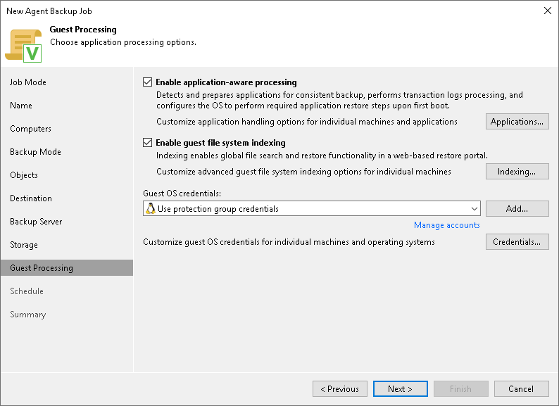

# Step 11. Specify Guest Processing Settings

In this article

At the Guest Processing step of the wizard, you can enable the following guest OS processing settings for a Veeam Agent backup policy that protects Linux-based computers:

* [Application-aware processing](#aap)
* [File indexing](#index)

Configuring Application-Aware Processing

Before you begin, review the [limitations of database processing](agents_backup_linux_dbs_processing.md).

To configure application-aware processing, do the following:

1. Select the Enable application-aware processing check box.
2. Click Applications.
3. In the Application-Aware Processing Options window, select a protection group or individual computer and click Edit.

To define custom settings for a computer added as a part of a protection group, you must include the computer to the list as a standalone object. To do this, click Add and choose the computer whose settings you want to customize. Then select the computer in the list and define the necessary settings.

1. In the Guest OS credentials list, select a user account that Veeam Agent will use for the processing of applications on the protected computer.

By default, the Use protection group credentials option is selected in the list. With this option selected, Veeam Agent will do one of the following:

* If you specified stored credentials for this computer in the protection group settings, Veeam Agent will process applications using the specified account.
* If you specified single-use credentials for this computer in the protection group settings, Veeam Agent will use the root user.

To learn more about stored and single-use credentials, see [Specifying Computers](agents_protection_group_computers.md).

If you want to use account that is not available in the Guest OS credentials list, click the Manage accounts link or click Add on the right to add credentials.

1. To specify credentials for a particular computer or a protection group, click Credentials on the right to set up credentials. In the Guest OS Credentials window, select a protection group or individual computer and click Set User.

If you specify custom credentials for a particular computer or a protection group in the Guest OS Credentials window, Veeam Agent will use these custom credentials instead of the credentials specified in the Guest OS credentials list (see Step 4).

Keep in mind that to specify credentials for a particular computer, you must include this computer to the backup job as a standalone object at the Computers step of the wizard. To do this, click Add and choose the computer whose credentials you want to add. Then select the computer in the list and specify the necessary credentials.

|  |
| --- |
| NOTE |
| Veeam Agent uses credentials selected in the Guest OS credentials list for Veeam Transport Service and database systems processing.  For file system indexing, MySQL processing and scripts execution, Veeam Agent always uses the root account. |

1. Configure the necessary settings for the selected protection group or individual computer:

* [For backup policies that protect servers] [General Settings](agent_policy_guest_general_linux.md)
* [For backup policies that protect servers] [Processing settings for Oracle database system](agent_policy_guest_oracle_linux.md)
* [For backup policies that protect servers] [Processing settings for MySQL database system](agent_policy_guest_mysql_linux.md)
* [For backup policies that protect servers] [Processing settings for PostgreSQL database system](agent_policy_guest_postgresql_linux.md)
* [Backup job and snapshot scripts](agent_policy_guest_scripts_linux.md)

File Indexing

To configure file indexing setiings:

1. Select the Enable guest file system indexing check box.
2. Click Indexing.
3. In the displayed list, select the protection group or individual computer and click Edit.

To define custom settings for a computer added as a part of a protection group, you must include the computer to the list as a standalone object. To do this, click Add and choose the computer whose settings you want to customize. Then select the computer in the list and define the necessary settings.

1. Configure file indexing settings for the selected protection group or individual computer. To learn more, see [File Indexing](agent_policy_linux_guest_indexing.md).

Page updated 7/29/2025

Page content applies to build 13.0.1.1071
