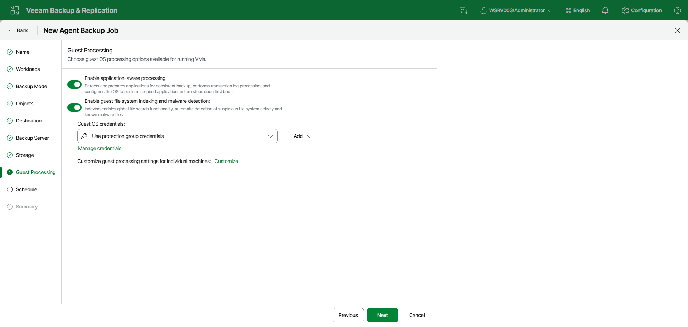

# Step 10. Specify Guest Processing Settings

At the Guest Processing step of the wizard, choose guest OS processing options for the Veeam Agent computers added to the backup policy. You can enable the following options:

* Enable application-aware processing — detects and prepares applications for consistent backup, performs transaction log processing, and configures the OS to perform required application restore steps upon first boot.
* Enable guest file system indexing and malware detection — indexing enables global file search functionality, automatic detection of suspicious file system activity and known malware files.

In the Guest OS credentials drop-down list, select a user account that Veeam Agent will use for the processing of applications on the protected computer. By default, the Use protection group credentials option is selected. If you want to use an account that is not available in the list, click the Manage credentials link or click Add on the right to add credentials.

|  |
| --- |
| NOTE |
| Veeam Agent uses credentials selected in the Guest OS credentials list for Veeam Transport Service and database systems processing. For file system indexing, MySQL processing and scripts execution, Veeam Agent always uses the root account. |

To configure guest processing settings for individual computers, click the Customize link. In the Customize Guest Processing Settings window, select a protection group or individual computer and use the toolbar to configure the settings:

* Add — adds an individual computer to the list as a standalone object so you can define custom settings for it, even if it is added to the backup policy as a part of a protection group.
* To specify credentials for a particular computer or a protection group, from the Credentials drop-down list, select Set User. In the Set User window, select an account to use for the selected object. Veeam Agent will use these custom credentials instead of the credentials specified in the Guest OS credentials drop-down list on the Guest Processing step.
* Application Settings — opens the Processing Settings window with per-computer application-aware processing, Oracle, MySQL, PostgreSQL, and script settings.
* From the Other Actions drop-down list, select Guest Indexing to open the per-computer guest file system indexing settings, or Remove to delete a custom entry from the list.

For more information about the individual guest processing settings, see:

* [Application-aware processing](agent_policy_guest_general_linux_web.md)
* [For backup policies that protect servers] [Processing settings for Oracle database system](agent_policy_guest_oracle_linux_web.md)
* [For backup policies that protect servers] [Processing settings for MySQL database system](agent_policy_guest_mysql_linux_web.md)
* [For backup policies that protect servers] [Processing settings for PostgreSQL database system](agent_policy_guest_postgresql_linux_web.md)
* [Use of pre-freeze and post-thaw scripts](agent_policy_guest_scripts_linux_web.md)
* [File indexing](agent_policy_linux_guest_indexing_web.md)

Page updated 2026-07-17

