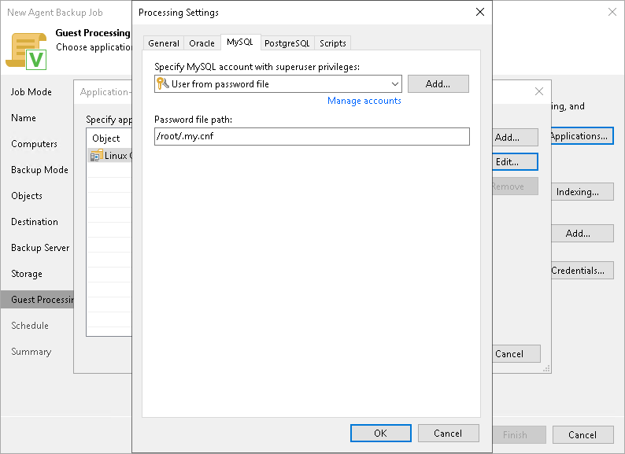

# MySQL Processing Settings

In this article

You can specify how Veeam Agent for Linux must process a MySQL database.

Before You Begin

Before you start working on the MySQL tab, check the following:

1. At the Guest Processing step of the wizard, the Enable application-aware processing check box is selected.
2. At the Guest Processing step of the wizard, in the Application-Aware Processing Options window, a necessary protection group or individual computer is added to the list.

To learn more, see [Guest Processing Settings](agent_policy_guest_linux.md).

1. On the General tab, in the Applications section, Require successful processing or Try application processing, but ignore failures option is selected.

To learn more, see [Application-Aware Processing](agent_policy_guest_general_linux.md).

1. MySQL tables with the MyISAM storage engine must be locked to keep them in a consistent state while Veeam Agent is creating the system snapshot. To correctly process such tables, make sure that the user account you want to specify in the MySQL processing settings has the following instance-wide privileges:

* SELECT. This privilege enables Veeam Agent to access tables' metadata and select for a lock the tables that use the MyISAM storage engine. Without this privilege, the processing of the MySQL database system will run successfully but MyISAM tables will not be locked, which may result in an inconsistent state of the backed up data.
* LOCK TABLES. This privilege is required for locking the selected MyISAM tables. If some MyISAM tables are selected but the MySQL account does not have the LOCK TABLES privilege, the processing of the MySQL database system will fail.
* RELOAD or FLUSH\_TABLES. If some MyISAM tables are selected but the MySQL account does not have either RELOAD or FLUSH\_TABLES privilege, the processing of the MySQL database system will fail.

To obtain information about the privileges that are assigned to an account, use MySQL functionality, for example, the SHOW GRANTS statement. To learn more, see [MySQL documentation](https://dev.mysql.com/doc/refman/8.0/en/show-grants.html).

Configuring MySQL Processing

To specify how Veeam Agent for Linux must process a MySQL database system, perform the following:

1. At the Guest Processing step of the wizard, click Applications.
2. In the Application-Aware Processing Options window, select the necessary object, click Edit and switch to the MySQL tab.
3. On the MySQL tab, specify a user account that Veeam Agent for Linux will use to connect to the MySQL database, from the Specify MySQL account with superuser privileges list, select a user account.

If you have not set up credentials beforehand, click the Manage accounts link or click Add on the right to add credentials.

By default, the User from password file option is selected in the list. With this option selected, Veeam Agent for Linux will connect to the MySQL database under the account specified in the password file on the Veeam Agent computer. The default location for the password file is /root/.my.cnf. For information about the password file format, see the [Preparing Password File for MySQL Processing](https://helpcenter.veeam.com/docs/agentforlinux/userguide/mysql_pass_file_wizard.html?ver=13) section in the Veeam Agent for Linux User Guide.

1. If you want to specify a custom path to the password file, specify a full path in the Password file path field. Specifying relative paths is not supported.

For information on how Veeam Agent for Linux processes the MySQL database system, see the [MySQL Backup](https://helpcenter.veeam.com/docs/agentforlinux/userguide/mysql_backup.html?ver=13) section in the Veeam Agent for Linux User Guide.

Page updated 11/4/2025

Page content applies to build 13.0.1.1071
