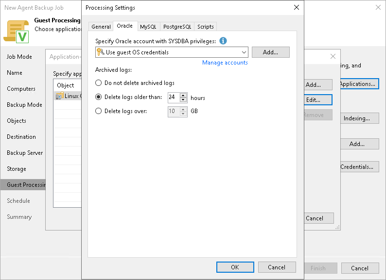

# Oracle Processing Settings

You can specify how Veeam Agent for Linux must process the Oracle database system.

Before You Begin

Before you start working with the Oracle database system, check the following:

1. At the Guest Processing step of the wizard, the Enable application-aware processing check box is selected.
2. At the Guest Processing step of the wizard, in the Application-Aware Processing Options window, a necessary protection group or individual computer is added to the list.
3. At the Guest Processing step of the wizard, in the Guest OS credentials list, a necessary user account is selected.

To learn more, see [Guest Processing Settings](agent_policy_guest_linux.md).

1. On the General tab, in the Applications section, Require successful processing or Try application processing, but ignore failures option is selected.

To learn more, see [Application-Aware Processing](agent_policy_guest_general_linux.md).

Configuring Oracle Processing

To specify how Veeam Agent for Linux must process the Oracle database system, perform the following:

1. At the Guest Processing step of the wizard, click Applications.
2. In the Application-Aware Processing Options window, select the necessary object, click Edit, then click the Oracle tab.
3. On the Oracle tab, specify a user account that Veeam Agent for Linux will use to connect to the Oracle database. You can do one of the following:

* Select from the Specify Oracle account with SYSDBA privileges list a database user account that has SYSDBA rights on the Oracle database.

If you have not set up credentials beforehand, click the Manage accounts link or click Add on the right to add credentials. With this option selected, Veeam Agent for Linux will connect to the Oracle database under the account that you have selected in the Specify Oracle account with SYSDBA privileges list.

* Select the Use guest OS credentials option.

With this option selected, Veeam Agent for Linux will do the following:

1. Veeam Agent will check if you specified custom credentials for the computer or protection group in the Guest OS Credentials window at the Guest Processing step of the wizard.

If you specified custom credentials for the computer or protection group in the Guest OS Credentials window, Veeam Agent will process the Oracle database under the OS account that you have specified in this window.

If you have not specified custom credentials for the computer or protection group, Veeam Agent will do as described in the step ii of this procedure.

To learn more, see [step 5 in Specify Guest Processing Settings](agent_policy_guest_linux.md#5).

1. Veeam Agent will check what have you selected in the Guest OS credentials list at the Guest Processing step of the wizard.

If you specified credentials in the Guest OS credentials list, Veeam Agent will process the Oracle database under the account that you have specified in this list.

If you have not specified credentials in the list and selected the Use protection group credentials option instead, Veeam Agent will do as described in the step iii of this procedure.

To learn more, see [step 4 in Specify Guest Processing Settings](agent_policy_guest_linux.md#4).

1. Veeam Agent will check what credentials have you specified for the computer or protection group at the Computers step of the wizard.

If you specified stored credentials for this computer in the protection group settings, Veeam Agent will process the Oracle database using the specified account.

If you specified single-use credentials for this computer in the protection group settings, Veeam Agent will process the Oracle database using the root user.

To learn more, see [Specifying Computers](agents_protection_group_computers.md).

1. In the Archived logs section, specify if Veeam Agent for Linux must delete archived logs on the Oracle database:

* Select Do not delete archived logs if you want Veeam Agent for Linux to preserve archived logs. When the backup policy completes, Veeam Agent for Linux will not delete archived logs.

It is recommended that you select this option for databases for which the ARCHIVELOG mode is turned off. If the ARCHIVELOG mode is turned on, archived logs may grow large and consume all disk space. In this case, the database administrator must take care of archived logs themselves.

* Select Delete logs older than <N> hours or Delete logs over <N> GB if you want Veeam Agent for Linux to delete archived logs that are older than <N> hours or larger than <N> GB. Veeam Agent for Linux will wait for the backup policy to complete successfully and then trigger archived logs truncation through Oracle Call Interface (OCI). If the backup policy fails, the logs will remain untouched until the next successful backup policy session.

