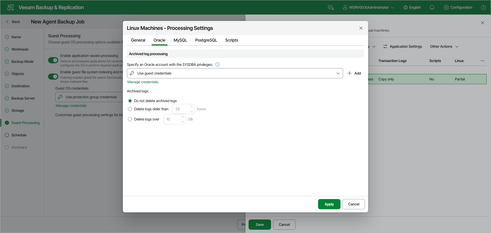

# Oracle Processing Settings

If you back up an Oracle database, you can specify how Veeam Agent for Linux must process archived logs:

1. At the Guest Processing step of the wizard, make sure that the Enable application-aware processing toggle is on.
2. Click Customize.
3. In the Customize Guest Processing Settings window, select the check box next to the protection group or individual computer and click Application Settings on the toolbar.
4. In the Processing Settings window, on the General tab, make sure that Require successful processing or Try application processing, but ignore failures is selected in the Applications section.
5. Open the Oracle tab.
6. Under Archived log processing, to specify a user account that Veeam Agent for Linux will use to connect to the Oracle database, from the Specify an Oracle account with the SYSDBA privileges drop-down list, select a database user account that has SYSDBA rights on the Oracle database.

If you have not set up credentials beforehand, click the Manage credentials link or click Add on the right to add credentials.

By default, the Use guest credentials option is selected. With this option selected, Veeam Agent for Linux will connect to the Oracle database under the account specified in the Guest OS credentials drop-down list at the Guest Processing step of the wizard.

1. In the Archived logs section, specify if Veeam Agent for Linux must delete archived logs on the Oracle database:

* Select Do not delete archived logs if you want Veeam Agent for Linux to preserve archived logs. When the backup policy completes, Veeam Agent for Linux will not delete archived logs.

It is recommended that you select this option for databases for which the ARCHIVELOG mode is turned off. If the ARCHIVELOG mode is turned on, archived logs may grow large and consume all disk space. In this case, the database administrator must take care of archived logs themselves.

* Select Delete logs older than or Delete logs over if you want Veeam Agent for Linux to delete archived logs that are older than the specified number of hours or larger than the specified size in GB. Veeam Agent for Linux will wait for the backup policy to complete successfully and then trigger archived logs truncation through Oracle Call Interface (OCI). If the backup policy fails, the logs will remain untouched until the next successful policy session.

Page updated 2026-07-17

