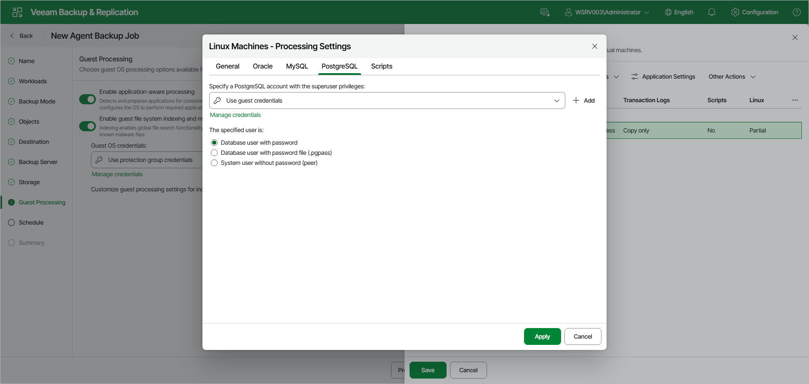

# PostgreSQL Processing Settings

You can specify how Veeam Agent for Linux must process the PostgreSQL database system.

Before You Begin

Before you configure PostgreSQL processing, consider the [Requirements and Limitations](https://helpcenter.veeam.com/docs/vbr/userguide/postgresql_backup.html?ver=13#requirements-and-limitations).

|  |
| --- |
| NOTE |
| By default, Veeam Agent recursively scans the /etc/postgresql, /var/lib/postgresql and /var/lib/pgsql directories for the configuration files of PostgreSQL instances. If you keep configuration files in custom directories, the pgsqlagent agent will use its own VeeamPostgreSQLAgent.xml configuration file that is located in the /etc/veeam/ directory. The pgsqlagent agent configuration file must be a single line XML.  To explicitly include or exclude specific configuration files from rescan, you can add the following commands to the VeeamPostgreSQLAgent.xml file:   * ExcludeConfigDirs — use this element to exclude configuration files. * AddConfigDirs — use this element to include configuration files.   For example: <config AddConfigDirs="/opt/psql/" ExcludeConfigDirs="/var/lib/postgresql/13/main45/,/var/lib/postgresql/13/maindd/" /> |

Configuring PostgreSQL Processing

To specify how Veeam Agent for Linux must process a PostgreSQL database system:

1. At the Guest Processing step of the wizard, make sure that the Enable application-aware processing toggle is on.
2. Click Customize.
3. In the Customize Guest Processing Settings window, select the check box next to the protection group or individual computer and click Application Settings on the toolbar.
4. In the Processing Settings window, on the General tab, make sure that Require successful processing or Try application processing, but ignore failures is selected in the Applications section.
5. Open the PostgreSQL tab.
6. From the Specify a PostgreSQL account with the superuser privileges drop-down list, select a user account that Veeam Agent for Linux will use to connect to the PostgreSQL database.

If you have not set up credentials beforehand, click the Manage credentials link or click Add on the right to add credentials.

By default, the Use guest credentials option is selected. With this option selected, Veeam Agent for Linux will connect to the PostgreSQL database under the account specified in the Guest OS credentials drop-down list at the Guest Processing step of the wizard.

Keep in mind that if you plan to select the peer authentication method at [step 7](#4) of this procedure, you can add a user account in the Credentials Manager without specifying the password for the account.

1. Under The specified user is, select how Veeam Agent will connect to the PostgreSQL database:

* Database user with password
* Database user with password file (.pgpass)
* System user without password (peer)

The The specified user is setting is connected closely with the Specify a PostgreSQL account with the superuser privileges drop-down list. Veeam Agent will do the following depending on what you specified using these two controls.

Configuring PostgreSQL Processing

| Control | | Veeam Agent Behavior |
| Specify a PostgreSQL Account with the Superuser Privileges | The Specified User Is |
| The Use guest credentials option is selected. | The Database user with password option is selected. | * Veeam Agent will apply the guest OS user for processing. * Veeam Agent will connect to the PostgreSQL database using the database user with the same name as the guest OS user. |
| The Database user with password file (.pgpass) option is selected. | * Veeam Agent will apply the guest OS user for processing. * Veeam Agent will connect to the PostgreSQL database using the password file stored in the home directory of the guest OS user. |
| The System user without password (peer) option is selected. | * Veeam Agent will apply the guest OS user for processing. * Veeam Agent will use the guest OS user for peer connection to the PostgreSQL database. |
| The user account is specified. | Database user with password option is selected. | * Veeam Agent will apply the guest OS user for processing. * Veeam Agent will connect to the PostgreSQL database using the database user specified in the Specify a PostgreSQL account with the superuser privileges list. |
| The Database user with password file (.pgpass) option is selected. | * Veeam Agent will apply the guest OS user for processing. * Veeam Agent will connect to the PostgreSQL database using the password file stored in the home directory of the user specified in the Specify a PostgreSQL account with the superuser privileges list. |
| The System user without password (peer) option is selected. | * Veeam Agent will apply the user specified in the Specify a PostgreSQL account with the superuser privileges list. * Veeam Agent will use the selected user for peer connection to the PostgreSQL database. |

For more information on how Veeam Agent for Linux processes the PostgreSQL database system, see the [PostgreSQL Backup](https://helpcenter.veeam.com/docs/agentforlinux/userguide/postgresql_backup.html?ver=13) section in the Veeam Agent for Linux User Guide.

Page updated 2026-07-17

