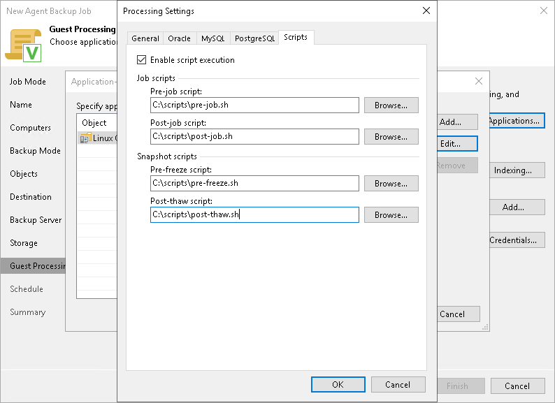

# Backup Job and Snapshot Scripts

You can specify custom scripts that will be executed within the backup policy session on Linux computers. Veeam Agent for Linux supports the following types of scripts:

* Backup job scripts — pre-job and post-job scripts that run on the Veeam Agent computer before and after the backup policy session.
* Snapshot scripts — pre-freeze and post-thaw scripts that run on the Veeam Agent computer before and after the volume snapshot is created.

To learn more about requirements for scripts, see [Backup Job Scripts](agents_backup_linux_scripts.md).

Veeam Backup & Replication offers 2 scenarios for specifying script settings:

* [Scenario 1. Specify backup job scripts and snapshot scripts](#jobandsnapshot).

You can specify both backup job scripts and snapshot scripts for the backup policy if you selected the Server computer type at the [Job Mode](agent_policy_protection_linux.md) step of the wizard and did not select the Backup directly from live file system option at the [Backup Mode](agent_policy_mode_linux.md) step of the wizard.

* [Scenario 2. Specify backup job scripts only](#onlyjob).

You can specify only backup policy scripts that will be executed on Linux computers if you selected the Workstation computer type at the [Job Mode](agent_policy_protection_linux.md) step of the wizard or if you selected the Backup directly from live file system option at the [Backup Mode](agent_policy_mode_linux.md) step of the wizard.

Specifying Backup Job and Snapshot Scripts

To specify custom scripts for the policy:

1. At the Guest Processing step, select the Enable application-aware processing check box.
2. Click Applications.
3. In the displayed list, select a protection group or individual computer and click Edit.

To define custom settings for a computer added as a part of a protection group, you must include the computer to the list as a standalone object. To do this, click Add and choose the computer whose settings you want to customize. Then select the computer in the list and define the necessary settings.

1. [For an entire computer backup or volume-level backup policy] In the Processing Settings window, click the Scripts tab.
   1. Select the Enable script execution check box.
   2. In the Job scripts section, specify custom scripts that you want to execute before and after the backup policy session. To do this, in the Pre-job script and Post-job script fields, click Browse and choose executable files from a local folder on the backup server.
   3. In the Snapshot scripts section, specify custom scripts that you want to execute before Veeam Agent for Linux creates a snapshot of the backed-up volume and after the snapshot is created. To do this, in the Pre-freeze script and Post-thaw script fields, click Browse and choose executable files from a local folder on the backup server.

   Veeam Agent for Linux supports scripts in the SH file format. During the backup policy session, Veeam Backup & Replication will upload the scripts to the /var/lib/veeam/scripts directory on each Veeam Agent computer added to the backup policy and execute them on these computers.

   

   Specifying Backup Job Scripts

   To specify custom scripts for the policy:

   1. At the Guest Processing step, select the Enable application-aware processing check box.
   2. Click Applications.
   3. In the displayed list, select a protection group or individual computer and click Edit.

   To define custom settings for a computer added as a part of a protection group, you must include the computer to the list as a standalone object. To do this, click Add and choose the computer whose settings you want to customize. Then select the computer in the list and define the necessary settings.

   1. In the Processing Settings window, select the Enable script execution check box.
   2. In the Pre-job script and Post-job script fields, click Browse to choose executable files from a local folder on the backup server.

   Veeam Agent for Linux supports scripts in the SH file format. During the backup policy session, Veeam Backup & Replication will upload the scripts to the /var/lib/veeam/scripts directory on each Veeam Agent computer added to the policy and execute them on these computers.

   

