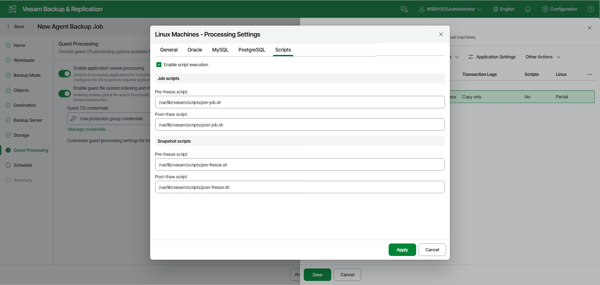

# Backup Job and Snapshot Script Settings

Before you configure script execution settings, review the considerations and limitations in the [Backup Job and Snapshot Scripts](agents_backup_linux_scripts.md) section.

You can specify custom scripts that will be executed within the backup policy session on Linux computers. Veeam Agent for Linux supports the following types of scripts:

* Job scripts — scripts that run on the Veeam Agent computer before and after the backup policy session.
* Snapshot scripts — scripts that run on the Veeam Agent computer before and after the volume snapshot is created.

|  |
| --- |
| IMPORTANT |
| Snapshot script settings are not available if you selected the Back up directly from a live file system option at the [Backup Mode](agent_policy_mode_linux_web.md) step of the wizard. If this option is selected, data will be backed up without a snapshot. |

|  |
| --- |
| TIP |
| You can also specify custom scripts that will be executed on the backup server before and after the backup policy session. To learn more, see [Script Settings](agent_advanced_scripts_linux_web.md). |

To specify pre-freeze and post-thaw scripts for the backup policy:

1. At the Guest Processing step of the wizard, make sure that the Enable application-aware processing toggle is on.
2. Click Customize.
3. In the Customize Guest Processing Settings window, select the check box next to the protection group or individual computer and click Application Settings on the toolbar.
4. In the Processing Settings window, open the Scripts tab.
5. Select the Enable script execution check box.
6. In the Job scripts section, in the Pre-freeze script and Post-thaw script fields, specify the path to executable files on the backup server. These scripts will run before and after the backup policy session.
7. In the Snapshot scripts section, in the Pre-freeze script and Post-thaw script fields, specify the path to executable files on the Veeam Agent computer. These scripts will run before and after Veeam Agent for Linux creates a snapshot of the backed-up volume.

During the backup policy session, Veeam Backup & Replication uploads the scripts to the /var/lib/veeam/scripts/<backup policy ID>/<script type>/ directory on each Veeam Agent computer included in the backup policy. Veeam Agent executes the scripts from the same directory under the root user.

Page updated 2026-07-17

