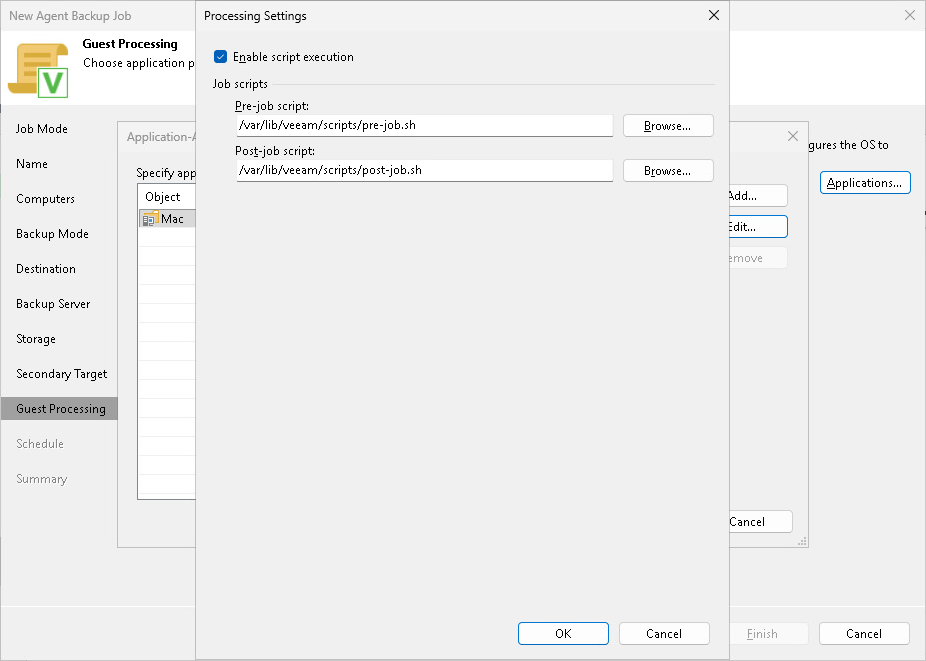

# Backup Job Scripts

You can specify custom backup job scripts that will be executed within the backup job session. Veeam Agent supports pre-job and post-job scripts that run on the Veeam Agent computer before and after the backup job session. To learn more about requirements for scripts, see [Backup Job Scripts](agents_backup_mac_scripts.md).

To specify custom scripts for a backup policy:

1. In the Application-Aware Processing Options window, select a protection group or individual computer and click Edit.

To define custom settings for a computer added as a part of a protection group, you must include the computer to the list as a standalone object. To do this, click Add and choose the computer whose settings you want to customize. Then select the computer in the list and define the necessary settings.

1. In the Processing Settings window, select Enable script execution.
2. In the Pre-job script and Post-job script fields, click Browse to choose executable files from a local folder on the backup server.

If you use Veeam Backup & Replication on Linux, you must place the scripts into the /var/lib/veeam/scripts/ directory on the backup server.

If you use Veeam Backup & Replication on Windows, you can place the script files in any local folder on the backup server.

During policy application session, Veeam Backup & Replication will upload the scripts to the /var/lib/veeam/scripts directory on each Veeam Agent computer added to the policy and execute them on these computers.

