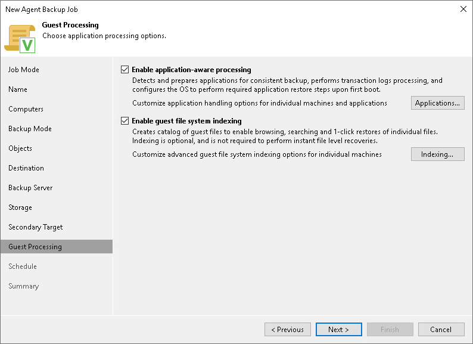

# Step 11. Specify Guest Processing Settings

At the Guest Processing step of the wizard, you can enable the following guest OS processing settings for a Veeam Agent backup job that includes Unix-based computers:

* [Use of backup job scripts](agent_policy_guest_scripts_unix.md)
* [File indexing](agent_policy_guest_indexing_unix.md)

