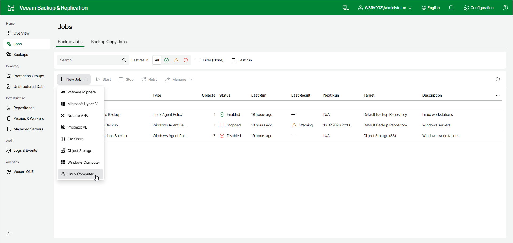

# Step 1. Launch New Agent Backup Job Wizard

You can create a Veeam Agent backup policy for protected computers that run a Linux OS in the Veeam Backup & Replication web UI in one of the following ways:

* [Create a new backup policy](#simple) — in this case, Veeam Backup & Replication will launch the New Agent Backup Job wizard. You will be able to specify protection groups and Veeam Agent computers to which the backup policy settings must apply at the [Computers](agent_policy_comp_linux_web.md) step of the wizard.
* [Add a protection group to a new backup policy](#group) — in this case, Veeam Backup & Replication will launch the New Agent Backup Job wizard and add the selected protection group to the backup policy. You will also be able to change the list of Veeam Agent computers to which the backup policy settings must apply at the [Computers](agent_policy_comp_linux_web.md) step of the wizard.
* [Add individual computers to a new backup policy](#computers) — in this case, Veeam Backup & Replication will launch the New Agent Backup Job wizard and add the selected computers to the backup policy. You will also be able to change the list of Veeam Agent computers to which the backup policy settings must apply at the [Computers](agent_policy_comp_linux_web.md) step of the wizard.

Launching Backup Job Wizard

To launch the New Agent Backup Job wizard:

1. In the management pane, click Jobs.
2. On the toolbar, click New Job > Linux Computer.

Adding Protection Group to New Backup Policy

To add a protection group to a new Veeam Agent backup policy:

1. In the management pane, click Protection Groups.
2. Select the check box next to the protection group that you want to add to the backup policy.
3. On the toolbar, click Add to backup job > Linux > New job. Alternatively, right-click the protection group and select Add to backup job > Linux > New job.

Veeam Backup & Replication will start the New Agent Backup Job wizard and add the protection group to the policy. You can add other protection groups and individual computers to the policy later on, when you pass through the wizard steps.

Adding Computers to New Backup Policy

To add specific computers to a new Veeam Agent backup policy:

1. In the management pane, click Protection Groups.
2. Select the protection group that contains the necessary computers.
3. In the working area, select the check boxes next to one or more computers that you want to add to the policy.
4. On the toolbar, click Add to backup job > New job. Alternatively, right-click the selected computer and select Add to backup job > New job.

Veeam Backup & Replication will start the New Agent Backup Job wizard and add the selected computers to the policy. You can add other computers and protection groups to the policy later on, when you pass through the wizard steps.

|  |
| --- |
| TIP |
| * You can add an individual computer or protection group to a Veeam Agent backup policy that is already configured in Veeam Backup & Replication. To learn more, see [Adding Computers to Backup Job](agents_protected_computers_add.md) and [Adding Protection Group to Backup Job](agents_protection_group_job.md). |

Page updated 2026-07-14

